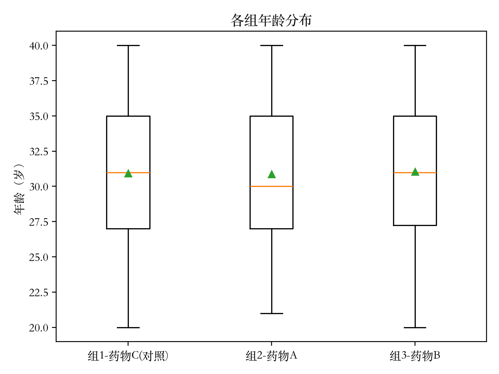
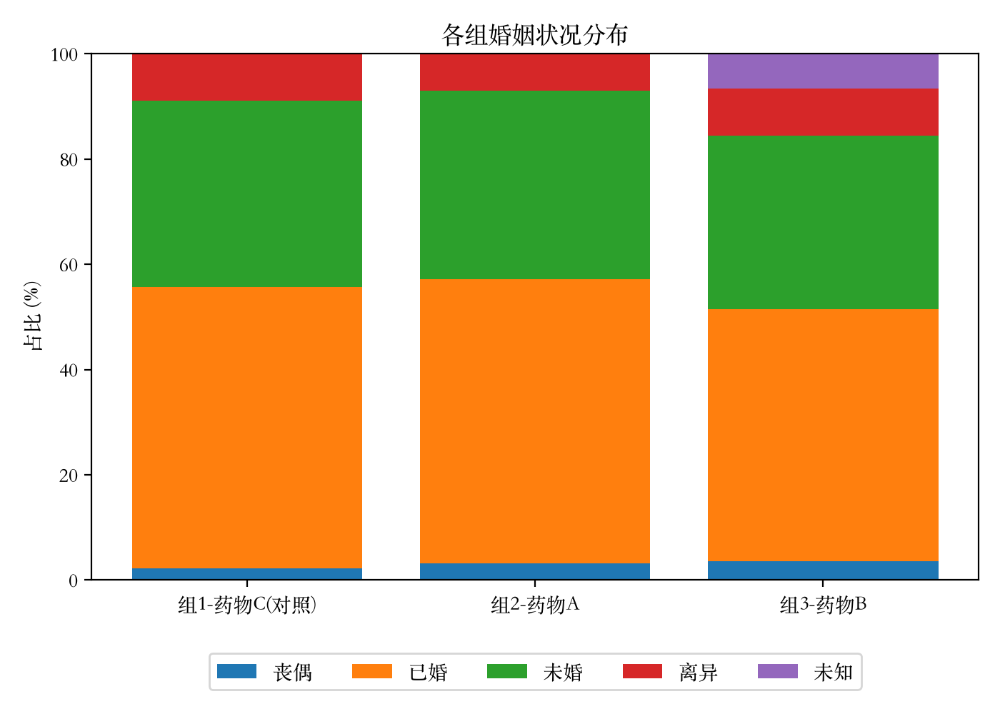
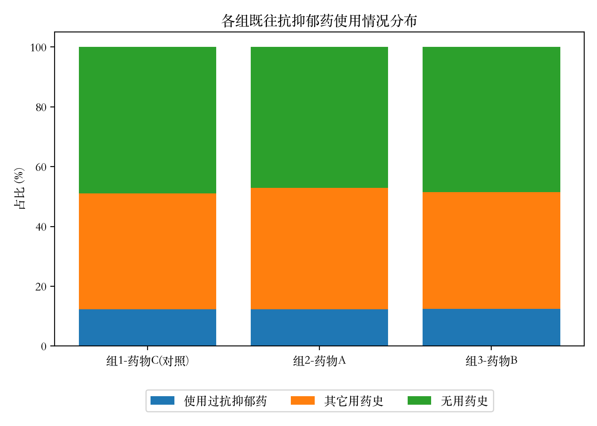
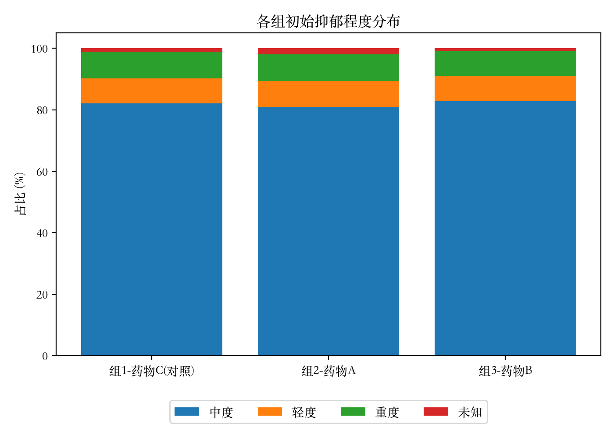
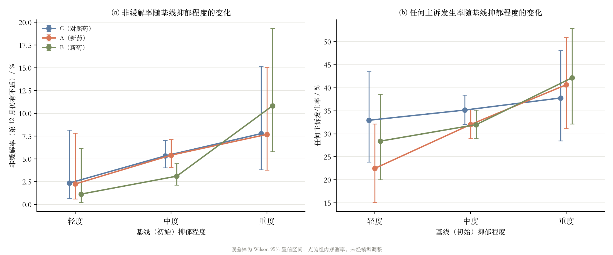
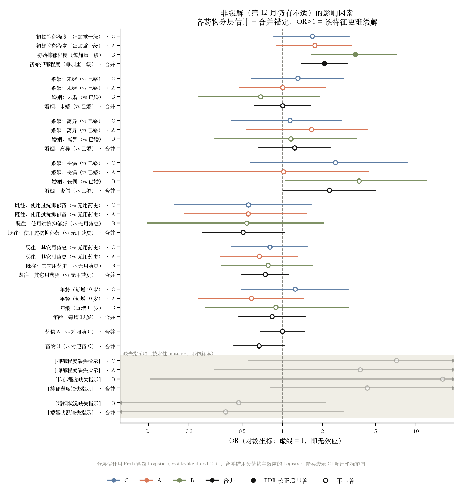
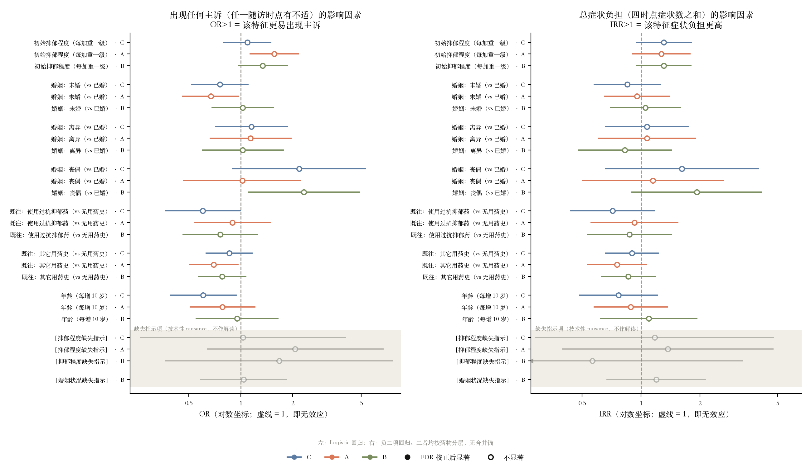

# 基于统计推断与综合评价模型的抗抑郁药物疗效研究

> **文档状态**：论文初稿（截至问题二完成）。
> 结构严格对齐 `数学建模论文超级模板.docx`：摘要 → 问题重述 → 问题分析 → 模型假设 → 符号约定 → 模型建立与求解 → 模型评价改进推广 → 参考文献 → 附录。
> **当前覆盖范围**：问题一、问题二已完整成文（含图 1–图 7）；问题三、四仅保留章节骨架，标注"待补充"。
> 数据来源：问题一 `output/table1_baseline_summary.csv`、`output/test_results.csv`（代码 `code/problem1_baseline.py`）；问题二 `output/problem2_or_table.csv`、`output/problem2_diagnostics.csv`、`output/problem2_severity_table.csv`（代码 `code/problem2_factors.py`）。
>
> **插图准入**（决定图**该不该有**，详见 `docs/adr/0011`）：一张图要进论文，须答得出"它支持正文的哪一句结论"、"删掉它那句话是否还站得住"、"它是否给出了表格给不了的东西"。
> 图的本职是呈现**形状、模式、对比**；**把表里已有的数字画成柱子不算**，这类图属自查用的诊断图，输出至 `output/diagnostics/`，不入论文、不占图号。
>
> **插图排版**（决定图**怎么排**，对齐 `references/` 中的范文，问题二至四续写时请沿用）：
> 1. 图号全文连续编号，且**必须按正文首次引用的先后排列**，不按变量或章节分组；
> 2. 版式为"正文引出 → 图片 → 图题 → 图解读"，图题置于图**下方**并加粗，格式为 `**图N␣␣图题**`（图号与图题间空两格，题末不加句号）；
> 3. 正文以"如图N 所示"引用，不写 `.png` 文件名——文件名统一在附录A 的图表清单中登记；
> 4. 每张图后须有一段解读，说明图中**看到了什么**（颜色/位置/形状）以及它**支持什么结论**，不可只插图不解释；
> 5. 图片以相对路径 `../output/xxx.png` 引用，便于 GitHub 预览与后续转 Word 时一并带入。

---

## 摘  要

抑郁症已成为全球范围内严重影响人类健康的疾病之一，抗抑郁药物的疗效与安全性评价是新药能否进入临床的前提。本文基于某制药公司两种新型抗抑郁药物（药物A、药物B）与已上市药物C的三臂随机对照临床试验数据，建立**统计推断与综合评价相结合的分析框架**，对三种药物的疗效进行系统评估。

**总体思路**：临床试验中观察到的疗效差异，只有在三组受试者"底子相同"的前提下才能归因于药物本身。因此本文以**基线均衡性检验**为逻辑起点，先证明三组可比，再逐层推进至影响因素分析、疗效综合评价与临床选药建议，形成"前提—归因—评价—决策"的递进链条。

**针对问题一**，本文建立**基线特征分布刻画与组间均衡性检验模型**。首先针对附件1的 one-hot 编码结构，设计**独热坍缩映射**将多列指示变量还原为单一分类变量，并将全空记录保留为"未知"类别而非直接删除，避免样本损失与选择偏倚；合并两院数据后得到 3149 例有效样本。随后按变量类型分流建模：对连续变量年龄，先以 Shapiro-Wilk 检验与 Levene 检验诊断正态性与方差齐性，据诊断结果在 ANOVA 与 Kruskal-Wallis 检验间自动择优；对三个分类变量采用 Pearson 卡方独立性检验，辅以 Cramér's V 效应量，并对期望频数不足的情形设置蒙特卡洛置换检验兜底；最后对四个变量的检验结果统一施加 Benjamini-Hochberg (FDR) 多重比较校正。

**问题一的结果**表明：三组在年龄（Kruskal-Wallis H=0.902，p=0.637，校正后 p=0.849）、既往抗抑郁药使用情况（χ²=0.877，p=0.928）、初始抑郁程度（χ²=4.744，p=0.577，校正后 p=0.849）上**均无统计学差异**；婚姻状况经检验存在显著差异（χ²=152.871，p<0.001）。本文进一步对该显著性做**归因分析**：卡方贡献度分解显示，总卡方值的 **91.5%** 由"未知"一列单独贡献，而该列全部来自药物B组的 70 例缺失（占该组 6.7%，其余两组该项零缺失）；剔除"未知"类别后重新检验，χ²=9.810，p=0.133，Cramér's V 由 0.156 降至 0.040，**差异消失**。这证明婚姻状况的"组间差异"实为**非随机缺失（MNAR）机制**的产物，而非三组人群婚姻构成的实质差异。此外，医院×组别的分配均衡性核查（χ²=0.001，p=0.9997）排除了医院这一潜在混杂因素。

**问题一的结论**：三组受试者基线特征基本均衡、具备可比性，后续观察到的疗效差异可在很大程度上归因于药物本身。这一结论构成全文的逻辑基石。

**针对问题二**，本文建立**按药物分层的多结局多因素回归模型**。首先解决两处数据陷阱：附件2 仅登记出现过不适的受试者（去重后 1085 人），故须以附件1 全体 3149 例为准做**左连接**，未连接的 2064 例判为"全程无不适"而非"数据缺失"——若直接以附件2 建模，回答的将是"在有不适的人群中"这一完全不同的问题；附件2 另存在 194 行**整块重复录入**（全部集中于二院药物A 组），按（医院,序号,组别）对症状标记**取并集**合并，使队列由 3343 恢复为 3149。据此构造三个结局：非缓解（$D_{12}=1$）、任何主诉（任一 $D_t=1$）、总症状负担（$\sum_t B_t$）。建模的核心难点是**非缓解为罕见结局**（各组仅 37–56 例，每参数事件数 EPV 仅 3.7–6.2，远低于经验阈值 10，且药物B 组存在完全分离格子），故按结局的稀有程度分流配置方法：非缓解采用 **Firth 惩罚 Logistic 回归**（Jeffreys 先验，在完全分离下仍给出有限估计）并配以**惩罚 profile-likelihood 置信区间**，另以合并三组、含药物主效应而不含交互项的 Logistic 模型（EPV≈12.4）作**稳定性锚定**；高发的任何主诉用普通 Logistic；计数型症状负担用**负二项回归**。全部 86 个系数检验施加 BH-FDR 校正。

**问题二的结果**表明：原始 α=0.05 下有 10 项因素"显著"，经 FDR 校正后**仅剩 2 项，且均为初始抑郁程度**——合并锚定模型中抑郁程度每加重一级，未缓解风险增至 **2.07 倍**（95%CI 1.40–3.05，校正后 p=0.003），药物B 组更陡（OR **3.51**，95%CI 1.64–7.19，校正后 p=0.013）。婚姻状况、既往用药史与年龄经校正后**均无统计学意义**（其中丧偶、年龄等边缘信号在校正后全部消失，且丧偶各组仅 23–38 例）。模型无关的描述层进一步佐证了这一剂量反应关系：三种药物的非缓解率均随基线抑郁程度**单调上升**。此外本文发现一个对问题四有价值的**提示性线索**：药物B 在轻、中度患者中非缓解率最低（1.1%、3.1%），在重度患者中却最高（10.8%），呈现**交叉**——但三组重度亚组的置信区间高度重叠（B 5.8%–19.3% vs C 3.8%–15.2%），且分层设计下无法对该交叉做正式检验，故本文明确将其定性为**待验证的假设而非结论**。

**问题二的结论**：在本试验数据中，能稳健影响疗效的基线因素只有病情本身（初始抑郁程度），婚姻状况与既往用药史等人口学因素的独立影响证据不足。这与问题一"三组基线可比"互为呼应：疗效差异主要由药物与病情驱动。

**本文的特色**在于：（1）不满足于给出 p 值，而是通过卡方贡献度分解与剔除敏感性分析，将"显著"这一结论**证伪并归因到数据缺失机制**，避免了"三组婚姻状况不同"这一误判；（2）方法选择由数据诊断驱动而非预先指定（问题一按正态性/方差齐性诊断择优，问题二按 EPV 与分离诊断择优），并全程报告效应量与置信区间而非仅报 p 值；（3）缺失数据保留为独立类别，如实反映数据特征，且缺失指示项被明确标记为技术性 nuisance 项而不予解读；（4）对罕见结局与完全分离这一常被忽视的统计陷阱做了正面处理（Firth 惩罚 + profile-likelihood 区间 + 合并锚定），而非放任标准回归给出天文数字的 OR。

**关键词**：抗抑郁药物；基线均衡性；假设检验；Kruskal-Wallis 检验；卡方独立性检验；多重比较校正；非随机缺失；Firth 惩罚 Logistic 回归；罕见结局；负二项回归

---

## 一、问题重述

### 1.1 问题背景

抑郁症是全球范围内严重影响人类健康的疾病之一。我国抑郁症患者已超过 9500 万人，且 20–40 岁的中青年成为高发群体，疾病不仅损害患者生活质量，也对社会经济造成沉重负担。抗抑郁药物是治疗抑郁症的重要手段，但不同药物在疗效与不良反应上存在差异，可能引发便秘、失眠、脱发等副作用。新药获准生产的前提是：**在很大程度上有效缓解抑郁症状，同时副作用可控**——这是一个疗效与安全性的双目标权衡问题。

某制药公司研发了两种面向成年人的新型抗抑郁药物（药物A、药物B），与已临床应用的药物C共同开展临床试验。试验设计要点如下：

- **分组**：三组，药物C为对照组（1组），药物A、药物B为试验组（2组、3组），每组设计 525 例；
- **中心**：两家医院，并假设两院的医院环境、医疗条件与主治医生水平无显著差异；
- **随访**：分别于第 1、3、6、12 月就主诉情况进行随访记录；
- **控制条件**：三药用量相同，不考虑用药量差异，亦不考虑成本与价格差异。

试验还给出了一条**特别的判定规则**：若受试者在用药前期出现不适症状（如失眠、脱发），但后期症状消失，可认为受试者已适应该药物——例如第 1、3 月主诉有不适、第 6、12 月无不适，则前三个月视为**适应期**，此时不计入药物的质量问题。

### 1.2 数据情况

- **附件1**（横截面）：两家医院临床受试者的身体指标与婚姻状况，含组别、年龄、婚姻状况、既往抗抑郁药使用情况、初始抑郁程度，均以 one-hot 形式编码。
- **附件2**（纵向、重复测量）：两院随访时的主诉情况记录。随访**仅对出现不适的受试者记录，使用感受良好者不予记录**；标注颜色栏目下的空格表示该时点未出现相应不适症状，"1"表示出现；"是否出现不适"栏是对第 1、3、6、12 月随访记录中出现不适症状的综合统计。部分受试者随访时难以联系造成**失访**，数据存在缺失。

### 1.3 需要解决的问题

- **问题一**：根据附件1，分析各组患者基线特征（年龄、婚姻状况、既往抗抑郁药使用情况、初始抑郁程度）的分布情况，比较各组之间是否存在显著差异。
- **问题二**：基于附件1和附件2，探讨婚姻状况、既往用药史和初始抑郁程度对药物疗效与主诉情况的影响，并分析这些因素与疗效指标、主诉情况之间的关系（每组数据对应一种药物，分析仅聚焦药物本身效果，不考虑其他治疗手段或因素间的交互作用）。
- **问题三**：对附件2中受试者的主诉情况进行分析，对比用药前后的不适症状变化，综合评估三种药物的疗效。指标包括但不限于抑郁症状改善程度、缓解率、复发率等；不需要考虑数据缺失和失访对评估的影响。
- **问题四**：综合三种药物的评价并结合患者基线特征，为临床医生选择合适的抗抑郁药物提供建议（不考虑用药量与价格等本题未涉及的因素）。

---

## 二、问题分析

### 2.1 总体分析：一条"前提—归因—评价—决策"的递进链条

四个问题并非彼此独立，而是层层递进、环环相扣的：

```
问题一  三组基线是否可比？          描述性统计 + 假设检验
   │    ——建立"疗效差异可归因于药物"这一前提
   ▼
问题二  哪些基线因素影响疗效？      回归 / 分层关联分析
   │    ——识别需要分层看待的人群维度
   ▼
问题三  三种药到底哪个好？          纵向重复测量 + 综合评价
   │    ——给出 A/B/C 的总体排名
   ▼
问题四  临床怎么选药？              综合决策（问题二 + 问题三的整合）
```

其中**问题一是全文的逻辑起点**。临床试验比较三种药物的疗效，其推断有效性完全依赖于一个前提：三组受试者在用药前"底子相同"。若某组本身病情更重、年龄更大，则后续观察到的疗效差异就可能来自人群构成的差异而非药物本身——这在流行病学上称为**混杂偏倚（confounding bias）**。因此问题一表面上只是"描述分布、比较差异"，实质上是在为问题二、三、四的因果归因**铺设前提**。这也决定了问题一的分析不能止步于给出 p 值，而必须对每一个"显著"的结果追问其来源。

### 2.2 问题一的分析

问题一要回答的是：三组在年龄、婚姻状况、既往用药史、初始抑郁程度四个基线变量上的分布是否存在显著差异。分析中需要处理四个关键难点：

**难点一：数据编码结构的还原。** 附件1中婚姻状况、既往用药史、抑郁程度均以 one-hot 形式分散在多列（如婚姻状况占"未婚/已婚/离异/丧偶"4 列，命中列填 1、其余空白）。统计检验需要的是单一分类变量，因此第一步必须设计从多列指示变量到单列分类变量的**坍缩映射**。更关键的是：当某行的一组 one-hot 列**全为空**时，意味着该项未记录（缺失），这部分样本如何处理将直接影响结论。

**难点二：检验方法的选择必须由数据诊断驱动。** 年龄为连续变量，三组均值比较的常规方法是单因素方差分析（ANOVA），但 ANOVA 要求各组数据近似正态且方差齐性。本题各组样本量 n>1000，属大样本情形，需先做诊断再决定用参数方法还是非参数方法，不能预先指定。

**难点三：多重比较带来的假阳性累积。** 本题一次性检验 4 个基线变量，若每个都以 α=0.05 独立判定，则至少出现一次假阳性的概率为 $1-(1-0.05)^4 \approx 18.5\%$，远高于名义水平。因此必须施加多重比较校正。

**难点四：对"显著"结果的归因追问。** 这是问题一最容易被忽略、却最关键的一点。若某个基线变量检验显著，直接下结论"三组该变量不同"是危险的——因为在 n>3000 的大样本下，卡方检验对极微小的差异也会给出极小的 p 值（统计显著 ≠ 实质显著）；更重要的是，**缺失数据的不均衡分布本身就会制造出虚假的组间差异**。因此对任何显著结果，都必须借助效应量、卡方贡献度分解与敏感性分析进一步排查其真实来源，否则将直接动摇全文的立论基础。

### 2.3 问题二的分析

问题二要回答的是：婚姻状况、既往用药史、初始抑郁程度这三个"入组时就已确定"的基线因素，是否影响受试者此后的疗效与主诉。相较问题一，本问的难点从"检验方法的选择"前移到了"因变量根本不存在"与"事件太少"两处。

**难点一：结局变量不在原始数据里，必须先构造，而构造前有两个数据陷阱。** 附件1 只有基线信息，疗效结局须从附件2 的随访记录中导出。但附件2 有两个易踩的坑：其一，题目已明言随访"仅对出现不适的受试者记录，使用感受良好者不予记录"，故附件2 的人数远少于附件1——**未出现在附件2 中的受试者不是"数据缺失"，恰恰是"全程无不适"即疗效最好的那批人**。若直接以附件2 建模，等于把疗效最好的人全部剔除，分析对象退化为"在有不适的人群中"，回答的是另一个问题，结论必然失真。其二，附件2 存在整块的重复录入，若不处理会凭空制造出大量"幽灵受试者"，污染对应药物组的全部结局。

**难点二：疗效结局是罕见事件，标准回归会失效。** 到第 12 月绝大多数受试者已缓解，"非缓解"因而是一个发生率仅 3%–5% 的罕见结局。逻辑回归的稳定性并不取决于总样本量，而取决于**每参数事件数（EPV）**——少数类事件数除以待估系数个数，经验阈值为 10。按药物分层后，各组非缓解事件仅 37–56 例而参数近 10 个，EPV 低至 3.7，且某些类别内事件数恰为 0（**完全分离**）。此时标准极大似然估计不收敛或给出趋于无穷的 OR，**这不是假想的风险，而是本题实际会发生的情形**。因此方法配置必须由结局的稀有程度驱动，而非对三个结局一视同仁地套用逻辑回归。

**难点三：分层带来的估计脆弱性与"不可比"。** 题目要求"每组数据对应一种药物，分析仅聚焦药物本身效果"，而组别与药物完全共线，故只能按药物分层建模、不建"药物×因素"交互项。代价是每组样本量降至约三分之一、事件数降至三分之一，分层估计的置信区间显著变宽；更重要的是，**三组的分层系数之间不能直接做统计意义上的比较**，只能做描述性对照。这一约束必须在解读"某因素在 B 组特别强"这类现象时严格守住。

**难点四：大规模多重比较。** 本问跨 3 个结局 × 3 个药物组 + 1 个合并模型，共计 86 个系数检验。若逐个以 α=0.05 判定，期望假阳性数可达 4 个以上，足以让"婚姻状况影响疗效"这类结论凭空出现。故必须与问题一口径一致地施加 FDR 校正，并以校正后 p 值作为判定依据。

### 2.4 问题三与问题四的分析（概要）

> 本节为后续章节预留，随问题三、四的完成逐步展开。

- **问题三**：本题核心。需充分利用 4 个随访时点的纵向结构，在指标层计算缓解率/复发率/改善程度并做组间检验，在轨迹层建立重复测量模型，在综合层用客观赋权法合成总排名。**"适应期豁免"规则必须在此落实。**
- **问题四**：整合题，不产生新统计量。将问题三的总体排名与问题二的分层结论（尤其是 5.2.6 节提出的"抑郁程度×药物"交叉线索）结合，输出可操作的决策规则。

---

## 三、模型假设及合理性说明

| 编号 | 假设 | 合理性说明 |
|---|---|---|
| **H1** | 两家医院的医院环境、医疗条件及主治医生医疗水平无显著差异，可将两院数据合并分析。 | **题目明确给定**。本文另以医院×组别列联表检验对该假设的适用性做了核查（见 5.1.6 节），证实分组在两院间完全均衡，合并分析不会引入中心偏倚。 |
| **H2** | 受试者按组别随机分配，组内个体相互独立。 | 三臂对照试验的标准设计前提。各组设计例数均为 525 例×2 院，样本量高度对称，符合随机化设计特征；独立性是卡方检验与 Kruskal-Wallis 检验的基本要求。 |
| **H3** | 三组受试者服用药物的用量相同，不考虑用药量、成本与价格的差异。 | **题目明确给定**，据此可将组别直接等同于"药物种类"这一单一处理因素。 |
| **H4** | 附件1中某项的 one-hot 列全为空，表示该项**信息缺失**（未记录/失访），而非表示"不属于任何类别"。 | 婚姻状况、既往用药史、抑郁程度的类别设置均已穷尽（如婚姻状况的未婚/已婚/离异/丧偶覆盖全部可能状态），逻辑上不存在"四类皆非"的受试者，故全空只能解释为缺失。 |
| **H5** | 缺失样本不予删除，统一记为"未知"类别参与分析。 | 若采用完整病例分析直接删除，一则损失样本量，二则——更严重的是——本题缺失**集中出现于药物B组**（非随机缺失），删除将引入选择偏倚。保留为独立类别既可如实反映数据特征，又使缺失机制本身成为可检验的对象（见 5.1.5 节）。 |
| **H6** | 年龄按连续变量处理，初始抑郁程度按**有序**分类变量处理（轻度<中度<重度）。 | 年龄以整数岁记录、取值范围 20–40 岁，作连续变量处理符合惯例；抑郁程度的三个等级具有天然的严重度序关系，该序关系在问题二的建模中可赋值 1/2/3 以利用其有序信息。 |
| **H7** | 显著性水平取 α=0.05，所有检验为双侧检验。 | 医学统计的通行标准，且题目未指定其他水平。 |
| **H8** | 附件1 中存在、但**未出现在附件2** 中的受试者，视为随访全程**无任何不适**，其各时点症状标记均记为 0，而非按缺失剔除。 | **题目明确给定**："随访仅对出现不适的受试者记录，使用感受良好者不予记录"。故未登记等价于"感受良好"，是一条有信息的记录而非缺失。据此附件1 左连接附件2，2064 例未连接者构成疗效最好的人群；若按缺失剔除，将系统性删除疗效最佳者，造成严重的选择偏倚（见 5.2.1 节）。 |
| **H9** | 附件2 中（医院,序号）相同的多行记录，属**同一受试者的重复录入**，而非序号相撞的不同受试者；合并时对每个"症状×时点"标记取并集。 | 附件1 的（医院,序号）唯一，且附件2→附件1 的连接零错配，故每个重复序号只对应一名真实受试者。取并集不会抹去任一份记录中的严重事件（如自杀倾向），对疗效评估最为保守。该口径的影响已量化且极小（见 5.2.5 节），详见 `docs/adr/0010`。 |
| **H10** | 问题二不构建"药物×因素"交互项，改按药物分层建模；三组的分层估计之间只作描述性对照，不作正式统计比较。 | **题目明确要求**"不考虑因素间的交互作用"，这是本文不建交互项、改按药物分层建模的**唯一依据**。需说明："组别"与"药物"完全一一对应（组1=药物C、组2=药物A、组3=药物B），二者是同一变量的两套编码、不可同时入模，本文统一采用药物编码；但这只意味着编码须择一，并**不意味着"药物×因素"交互项本身在数学上不可识别**（在不同时放入组别编码的前提下，合并模型中的"药物×抑郁程度"交互项可正常估计，见 6.3(5)）。故分层是题目约束下的选择，而非数学上的唯一可行解。详见 `docs/adr/0006`。 |

---

## 四、符号约定

| 符号 | 定义 | 单位 |
|---|---|---|
| $g$ | 组别编号，$g\in\{1,2,3\}$，分别对应药物C（对照）、药物A、药物B | — |
| $N$ | 合并两院后的总样本量，$N=3149$ | 例 |
| $n_g$ | 第 $g$ 组的样本量 | 例 |
| $x_{gi}$ | 第 $g$ 组第 $i$ 位受试者的年龄 | 岁 |
| $\bar{x}_g,\ s_g$ | 第 $g$ 组年龄的样本均值与样本标准差 | 岁 |
| $W$ | Shapiro-Wilk 正态性检验统计量 | — |
| $L$ | Levene 方差齐性检验统计量 | — |
| $F$ | 单因素方差分析（ANOVA）的 F 统计量 | — |
| $H$ | Kruskal-Wallis 秩和检验统计量 | — |
| $R_{gi}$ | $x_{gi}$ 在全体样本混合排序后的秩；$\bar{R}_g$ 为第 $g$ 组的平均秩 | — |
| $O_{ij},\ E_{ij}$ | 列联表第 $i$ 行第 $j$ 列的观测频数与期望频数 | 例 |
| $\chi^2$ | Pearson 卡方独立性检验统计量 | — |
| $r,\ c$ | 列联表的行数与列数 | — |
| $\mathrm{df}$ | 自由度 | — |
| $V$ | Cramér's V 效应量，$V\in[0,1]$ | — |
| $C_{j}$ | 列联表第 $j$ 列对总卡方值的贡献度 | — |
| $\alpha$ | 显著性水平，取 0.05 | — |
| $p_{(k)}$ | 将 $m$ 个原始 p 值升序排列后的第 $k$ 个 | — |
| $p^{\mathrm{adj}}$ | 经 Benjamini-Hochberg 法校正后的 p 值 | — |
| $m$ | 同时进行的检验个数，问题一中 $m=4$ | — |
| $D_t$ | 受试者在第 $t$ 月随访时是否出现不适的指示变量，$t\in\{1,3,6,12\}$ | — |
| $B_t$ | 受试者在第 $t$ 月的症状负担（不适症状种类数），$B_t\in\{0,1,\dots,7\}$ | 种 |
| $y_i$ | 第 $i$ 位受试者的结局取值（二分类结局取 0/1，计数结局取非负整数） | — |
| $\boldsymbol{x}_i$ | 第 $i$ 位受试者的协变量向量（含截距） | — |
| $\boldsymbol{\beta}$ | 回归系数向量；$\beta_j$ 为第 $j$ 个协变量的系数 | — |
| $\pi_i$ | 第 $i$ 位受试者的结局发生概率，$\pi_i=\Pr(y_i=1\mid \boldsymbol{x}_i)$ | — |
| $\mu_i$ | 计数结局的条件均值，$\mu_i=\mathbb{E}(y_i\mid \boldsymbol{x}_i)$ | 种 |
| $\mathrm{OR}_j$ | 优势比，$\mathrm{OR}_j=e^{\beta_j}$；$>1$ 表示该特征使结局更易发生 | — |
| $\mathrm{IRR}_j$ | 发生率比，$\mathrm{IRR}_j=e^{\beta_j}$（负二项回归） | — |
| $\ell(\boldsymbol{\beta}),\ \ell^{*}(\boldsymbol{\beta})$ | 对数似然函数、Firth 惩罚对数似然函数 | — |
| $\boldsymbol{I}(\boldsymbol{\beta})$ | Fisher 信息矩阵，$\boldsymbol{I}=\boldsymbol{X}^{\!\top}\boldsymbol{W}\boldsymbol{X}$ | — |
| $h_i$ | 帽子矩阵 $\boldsymbol{H}=\boldsymbol{W}^{1/2}\boldsymbol{X}\boldsymbol{I}^{-1}\boldsymbol{X}^{\!\top}\boldsymbol{W}^{1/2}$ 的第 $i$ 个对角元 | — |
| $\theta$ | 负二项分布的过离散参数，$\mathrm{Var}(y_i)=\mu_i+\theta\mu_i^{2}$ | — |
| $\mathrm{EPV}$ | 每参数事件数（events per variable）= 少数类事件数 ÷ 待估参数个数 | — |
| $S$ | 初始抑郁程度的有序编码，轻度/中度/重度分别取 1/2/3 | — |

> 注：$D_t$、$B_t$ 及回归相关符号为问题二至问题四所用，在此一并约定以保持全文一致。

---

## 五、模型的建立与求解

### 5.1 问题一：基线特征分布刻画与组间均衡性检验模型

#### 5.1.1 前期准备：数据预处理

**（1）独热坍缩映射。** 设某分类属性 $A$ 在附件1中占据 $q$ 个 one-hot 列 $(a_1,a_2,\dots,a_q)$，其取值满足 $a_k\in\{1,\varnothing\}$。定义坍缩映射 $\phi$：

$$
\phi(a_1,\dots,a_q)=
\begin{cases}
\text{name}(a_k), & \exists\, k \text{ 使 } a_k=1\\[4pt]
\text{“未知”}, & \forall\, k,\ a_k=\varnothing
\end{cases}
$$

据此将婚姻状况（4 列：未婚/已婚/离异/丧偶）、既往用药史（3 列：无用药史/使用过抗抑郁药/其它用药史）、抑郁程度（3 列：轻度/中度/重度）分别还原为单一分类变量。依假设 H4、H5，全空记录映射为"未知"而非删除。

**（2）数据合并与质量核查。** 将两院数据纵向拼接，得总样本量 $N=3149$ 例。各组与各院的样本量分布为：

| 医院 | 组1-药物C（对照） | 组2-药物A | 组3-药物B | 合计 |
|---|---|---|---|---|
| 一院 | 525 | 525 | 525 | 1575 |
| 二院 | 524 | 525 | 525 | 1574 |
| **合计** | **1049** | **1050** | **1050** | **3149** |

与试验设计的 525 例×3 组×2 院 = 3150 例相比实际少 1 例（二院组1为 524 例）。经核查该缺例存在于原始数据之中，非数据处理所致，对后续分析无实质影响。

**（3）缺失情况。** 经坍缩映射后，各变量的缺失（"未知"）分布为：年龄缺失 1 例（组1）；婚姻状况缺失 70 例，**全部集中于组3-药物B**；抑郁程度缺失 42 例（组1为 12 例、组2为 20 例、组3为 10 例），分布相对均匀；既往用药史无缺失。**婚姻状况缺失的高度集中性是后续 5.1.5 节归因分析的核心线索。**

#### 5.1.2 模型建立：由数据诊断驱动的检验方法选择

依变量类型将检验任务分流为两条支路，其总体流程如下：

```
                    基线变量
                       │
        ┌──────────────┴──────────────┐
        ▼                             ▼
   连续变量（年龄）              分类变量（婚姻/用药史/抑郁程度）
        │                             │
   Shapiro-Wilk 正态性检验       Pearson 卡方独立性检验
   Levene 方差齐性检验                │
        │                        min(Eij) < 5 ?
   两前提均满足?                      │
    ├─ 是 → ANOVA              ├─ 是 → 蒙特卡洛置换检验兜底
    └─ 否 → Kruskal-Wallis     └─ 否 → 直接采用卡方结果
        │                             │
        └──────────────┬──────────────┘
                       ▼
          Benjamini-Hochberg (FDR) 多重比较校正
                       ▼
              显著? ──是──→ 效应量 + 贡献度分解 + 敏感性分析（归因）
```

**（1）连续变量（年龄）的检验模型。**

*步骤一：正态性诊断。* 对第 $g$ 组年龄数据做 Shapiro-Wilk 检验，统计量为

$$
W_g=\frac{\left(\sum_{i=1}^{n_g} a_i x_{g(i)}\right)^{2}}{\sum_{i=1}^{n_g}\left(x_{gi}-\bar{x}_g\right)^{2}}
$$

其中 $x_{g(i)}$ 为组内升序排列的次序统计量，$a_i$ 为由标准正态次序统计量的期望与协方差矩阵确定的系数。原假设 $H_0$：数据来自正态总体。

*步骤二：方差齐性诊断。* 采用基于中位数的 Levene 检验（Brown-Forsythe 形式），令 $z_{gi}=\left|x_{gi}-\tilde{x}_g\right|$（$\tilde{x}_g$ 为组中位数），统计量为

$$
L=\frac{(N-k)}{(k-1)}\cdot\frac{\sum_{g=1}^{k} n_g\left(\bar{z}_g-\bar{z}\right)^{2}}{\sum_{g=1}^{k}\sum_{i=1}^{n_g}\left(z_{gi}-\bar{z}_g\right)^{2}}
$$

其中 $k=3$ 为组数。原假设 $H_0$：各组方差相等。

*步骤三：主检验方法的自动选择。* 记正态性通过条件为 $\forall g,\ p_{W_g}>\alpha$，方差齐性通过条件为 $p_L>\alpha$。则

$$
\text{主检验}=
\begin{cases}
\text{单因素 ANOVA:}\quad F=\dfrac{\sum_g n_g(\bar{x}_g-\bar{x})^{2}/(k-1)}{\sum_g\sum_i (x_{gi}-\bar{x}_g)^{2}/(N-k)}, & \text{两前提均满足}\\[14pt]
\text{Kruskal-Wallis:}\quad H=\dfrac{12}{N(N+1)}\sum_{g=1}^{k} n_g \bar{R}_g^{2}-3(N+1), & \text{否则}
\end{cases}
$$

Kruskal-Wallis 检验比较的是三组的秩分布而非均值，不要求正态性，在 $H_0$ 成立时 $H\sim\chi^2(k-1)$。

*步骤四：事后两两比较（条件触发）。* 若主检验显著，则进一步做两两比较以定位差异来源：ANOVA 路径用 Tukey HSD，Kruskal-Wallis 路径用 Mann-Whitney U 检验并施加 Bonferroni 校正。

**（2）分类变量的检验模型。**

*Pearson 卡方独立性检验。* 对"组别×类别"的 $r\times c$ 列联表，在独立性原假设下期望频数为 $E_{ij}=\dfrac{R_i C_j}{N}$（$R_i$、$C_j$ 分别为行和与列和），统计量为

$$
\chi^{2}=\sum_{i=1}^{r}\sum_{j=1}^{c}\frac{\left(O_{ij}-E_{ij}\right)^{2}}{E_{ij}} \ \sim\ \chi^{2}\big((r-1)(c-1)\big)
$$

原假设 $H_0$：受试者落入哪个类别与其属于哪一组相互独立（即三组分布一致）。

*适用条件核查与兜底。* 卡方分布是列联表精确分布的渐近近似，通常要求 $\min_{i,j} E_{ij}\ge 5$。若该条件不满足，本文改以**蒙特卡洛置换检验**给出稳健 p 值：将组别标签随机重排 $B=2000$ 次，每次重算卡方值 $\chi^2_{(b)}$，则

$$
p_{\text{perm}}=\frac{1+\#\left\{b:\chi^{2}_{(b)}\ge\chi^{2}_{\text{obs}}\right\}}{B+1}
$$

该 p 值不依赖任何分布假设，可作为卡方结果的交叉验证。

*效应量。* 大样本下卡方检验对微小差异亦高度敏感，故必须同时报告与样本量无关的效应量 Cramér's V：

$$
V=\sqrt{\frac{\chi^{2}}{N\cdot\min(r-1,\ c-1)}},\qquad V\in[0,1]
$$

**（3）多重比较校正。** 对 4 个基线变量的主检验 p 值统一施加 Benjamini-Hochberg 法控制错误发现率（FDR）。将 $m=4$ 个原始 p 值升序排列为 $p_{(1)}\le\cdots\le p_{(m)}$，则校正后 p 值为

$$
p^{\mathrm{adj}}_{(k)}=\min_{j\ge k}\left\{\min\left(\frac{m}{j}\,p_{(j)},\ 1\right)\right\}
$$

相较 Bonferroni 法，BH 法在控制假阳性的同时保留了更高的检验效能，适用于本题这类同时考察多个变量的探索性分析。

#### 5.1.3 模型求解：基线特征的分布刻画（Table 1）

**（1）年龄。** 三组年龄的描述性统计如下：

| 组别 | n（非缺失） | 缺失 | 均值 ± 标准差（岁） | 中位数（IQR） | 范围（岁） |
|---|---|---|---|---|---|
| 组1-药物C（对照） | 1048 | 1 | 30.92 ± 4.59 | 31.0（27.0–35.0） | 20–40 |
| 组2-药物A | 1050 | 0 | 30.86 ± 4.76 | 30.0（27.0–35.0） | 21–40 |
| 组3-药物B | 1050 | 0 | 31.04 ± 4.53 | 31.0（27.2–35.0） | 20–40 |

三组均值极差仅 0.18 岁，标准差与四分位距亦高度接近，其分布形态如图1 所示。



**图1  各组年龄分布箱线图**

图1 中橙色横线为组内中位数、绿色三角为组内均值。三组的箱体（四分位距 27–35 岁）几乎完全重合，中位数（31/30/31 岁）与均值两两相差不足 0.2 岁，上下须亦均覆盖 20–40 岁的全域（仅组2 的下须止于 21 岁），未见任何一组在年龄上系统性偏高或偏低。受试者年龄集中于 20–40 岁，与题目所述"中青年为抑郁症高发群体"的背景相符。

**（2）婚姻状况。**

| 组别 | 已婚 | 未婚 | 离异 | 丧偶 | 未知 | 合计 |
|---|---|---|---|---|---|---|
| 组1-药物C（对照） | 561（53.5%） | 371（35.4%） | 94（9.0%） | 23（2.2%） | 0（0.0%） | 1049 |
| 组2-药物A | 567（54.0%） | 376（35.8%） | 74（7.0%） | 33（3.1%） | 0（0.0%） | 1050 |
| 组3-药物B | 503（47.9%） | 345（32.9%） | 94（9.0%） | 38（3.6%） | **70（6.7%）** | 1050 |

三组婚姻状况的构成对比如图2 所示。



**图2  各组婚姻状况构成堆积柱状图**

图2 最醒目的特征是：代表"未知"的紫色色块**仅出现在组3-药物B 的柱顶**，另两组完全没有这一色块。正因这 6.7% 的份额被"未知"占去，组3 各实质类别的占比才整体下移——**这是一个由缺失挤占份额造成的结构性现象，而非婚姻构成本身的偏移**，5.1.5 节将对此做定量验证。

**（3）既往抗抑郁药使用情况。**

| 组别 | 无用药史 | 其它用药史 | 使用过抗抑郁药 | 合计 |
|---|---|---|---|---|
| 组1-药物C（对照） | 513（48.9%） | 407（38.8%） | 129（12.3%） | 1049 |
| 组2-药物A | 495（47.1%） | 426（40.6%） | 129（12.3%） | 1050 |
| 组3-药物B | 509（48.5%） | 410（39.0%） | 131（12.5%） | 1050 |

三组构成高度一致，"使用过抗抑郁药"的比例几乎完全相同（12.3%/12.3%/12.5%）。三组的构成对比如图3 所示。



**图3  各组既往抗抑郁药使用情况构成堆积柱状图**

图3 中三根柱体的分层高度几乎无法用肉眼区分：蓝色（使用过抗抑郁药）色块的顶边齐平于 12% 附近，橙色（其它用药史）与绿色（无用药史）的分界也仅在 51%–53% 间浮动。此外该变量是四个基线变量中唯一**无任何缺失**的一项，故柱体中不含"未知"色块——这也解释了为何其卡方值（0.877）在三个分类变量中最低。

**（4）初始抑郁程度。**

| 组别 | 轻度 | 中度 | 重度 | 未知 | 合计 |
|---|---|---|---|---|---|
| 组1-药物C（对照） | 85（8.1%） | 862（82.2%） | 90（8.6%） | 12（1.1%） | 1049 |
| 组2-药物A | 89（8.5%） | 850（81.0%） | 91（8.7%） | 20（1.9%） | 1050 |
| 组3-药物B | 88（8.4%） | 869（82.8%） | 83（7.9%） | 10（1.0%） | 1050 |

三组均呈"中度占绝对多数（约 81%–83%）、轻重两端各约 8%"的一致格局，且缺失比例均在 2% 以内、分布均匀，如图4 所示。



**图4  各组初始抑郁程度构成堆积柱状图**

图4 与图2 恰成对照：此处代表"未知"的红色色块在三组柱顶**均存在且都极窄**（1.1%/1.9%/1.0%），而图2 的"未知"色块是**一组独有、另两组全无**。同为缺失，二者在图形上的这一差别，正是"分布均匀的零星缺失"与"集中于单组的系统性缺失"之别——后者才是 5.1.5 节所要追查的对象。

#### 5.1.4 模型求解：组间差异的假设检验结果

**（1）年龄的诊断与主检验。** 诊断结果如下：

| 诊断项 | 结果 | 判定 |
|---|---|---|
| Shapiro-Wilk 正态性（三组） | $p_W\approx 0$（三组均 $<10^{-10}$） | **不满足**正态性 |
| Levene 方差齐性 | $p_L=0.1751$ | 满足方差齐性 |

由于正态性前提不满足，依 5.1.2 节的选择规则自动切换至 **Kruskal-Wallis 检验**：

$$
H=0.902,\quad \mathrm{df}=2,\quad p=0.637
$$

> **关于 Shapiro-Wilk 判定"非正态"的说明。** 各组 n>1000 属大样本，而 Shapiro-Wilk 检验的功效随样本量增大而急剧上升，以致对与正态分布的任何微小偏离都会给出极小的 p 值——这是该检验的**已知固有特性**，不应据此认为年龄数据存在严重偏态。此处切换至非参数方法是出于**稳健性**考虑：Kruskal-Wallis 不依赖正态性假设，其结论无需为该前提辩护。作为交叉验证，若强行采用 ANOVA，结果为 $F=0.42,\ p=0.657$，与 Kruskal-Wallis 结论完全一致（均不显著），说明该结论对方法选择不敏感。因主检验不显著，事后两两比较未被触发。

**（2）分类变量的卡方检验。**

| 变量 | $\chi^2$ | df | $\min E_{ij}$ | 原始 p | Cramér's V | 是否需置换兜底 |
|---|---|---|---|---|---|---|
| 婚姻状况 | 152.871 | 8 | 23.32 | $4.94\times10^{-29}$ | 0.156 | 否（$\min E_{ij}\ge5$） |
| 既往用药史 | 0.877 | 4 | 129.58 | 0.9279 | 0.012 | 否 |
| 初始抑郁程度 | 4.744 | 6 | 13.99 | 0.5770 | 0.027 | 否 |

三个变量的最小期望频数均远大于 5，卡方分布的渐近近似成立，蒙特卡洛置换兜底机制未被触发。

**（3）多重比较校正后的总览。** 对 4 个主检验 p 值施加 BH-FDR 校正：

| 检验对象 | 方法 | 统计量 | 原始 p | FDR 校正 p | α=0.05 下是否显著 |
|---|---|---|---|---|---|
| 年龄 | Kruskal-Wallis | H=0.902 | 0.637 | 0.849 | 否 |
| **婚姻状况** | 卡方独立性检验 | χ²=152.871 | <0.001 | **<0.001** | **是** |
| 既往用药史 | 卡方独立性检验 | χ²=0.877 | 0.928 | 0.928 | 否 |
| 初始抑郁程度 | 卡方独立性检验 | χ²=4.744 | 0.577 | 0.849 | 否 |

即：**年龄、既往用药史、初始抑郁程度三组间无统计学差异；唯有婚姻状况显著。** 下一节对这唯一的显著结果做归因排查。

#### 5.1.5 结果验证：婚姻状况显著性的归因分析

若就此断言"三组婚姻状况存在差异"，将直接动摇全文"三组可比"的立论。因此本文对该显著性做三重排查。

**（1）效应量诊断。** 婚姻状况的 Cramér's V=0.156。按 Cohen 的判定标准（$\mathrm{df}^*=\min(r-1,c-1)=2$ 时，small=0.07、medium=0.21、large=0.35），该效应量仅介于**小到中等之间**，与 $\chi^2=152.871$、$p\approx 5\times10^{-29}$ 所呈现的"极度显著"形成强烈反差。这一反差正是大样本（N=3149）下卡方检验高敏感性的典型表现，提示**统计显著性并不等同于实质差异**，须进一步追查其结构来源。

**（2）卡方贡献度分解。** 将总卡方值按列拆解，令第 $j$ 列的贡献度为 $C_j=\sum_{i=1}^{r}\dfrac{(O_{ij}-E_{ij})^2}{E_{ij}}$：

| 类别 | 对 $\chi^2$ 的贡献 $C_j$ | 占总卡方比例 |
|---|---|---|
| **未知** | **139.93** | **91.5%** |
| 已婚 | 4.63 | 3.0% |
| 丧偶 | 3.71 | 2.4% |
| 离异 | 3.07 | 2.0% |
| 未婚 | 1.54 | 1.0% |
| **合计** | **152.87** | 100% |

结果极为清晰：**总卡方值的 91.5% 由"未知"一列单独贡献**，而四个实质婚姻类别加总仅贡献 8.5%。由于"未知"列的 70 例全部来自组3-药物B（其余两组该项零缺失），这一列本身就是一个完全由缺失构成的"人造类别"。

**（3）剔除"未知"后的敏感性分析。** 移除"未知"列、仅就四个实质类别重做 $3\times4$ 列联表的卡方检验：

| 分析方案 | $\chi^2$ | df | p 值 | Cramér's V | 结论 |
|---|---|---|---|---|---|
| 含"未知"（主分析） | 152.871 | 8 | $<0.001$ | 0.156 | 显著 |
| **剔除"未知"（敏感性分析）** | **9.810** | **6** | **0.133** | **0.040** | **不显著** |

剔除后各组在实质类别上的构成为：

| 组别 | 已婚 | 未婚 | 离异 | 丧偶 | n |
|---|---|---|---|---|---|
| 组1-药物C（对照） | 53.5% | 35.4% | 9.0% | 2.2% | 1049 |
| 组2-药物A | 54.0% | 35.8% | 7.0% | 3.1% | 1050 |
| 组3-药物B | 51.3% | 35.2% | 9.6% | 3.9% | 980 |

三组构成高度接近，且 Cramér's V 由 0.156 骤降至 0.040（近乎无效应）、p 值由 $<0.001$ 升至 0.133（不显著）。**这定量地证明：婚姻状况的组间"差异"完全由缺失分布的不均衡所制造，而非三组人群婚姻构成的实质差异。**

**（4）缺失机制的检验与定性。** 进一步就"是否缺失"与"组别"构建 $3\times2$ 列联表检验，得 $\chi^2=143.115,\ \mathrm{df}=2,\ p=8.38\times10^{-32}$——**缺失与否高度依赖于组别**。据 Little & Rubin 的缺失机制分类，该模式不属于完全随机缺失（MCAR），而是与分组这一关键变量系统相关的**非随机缺失（MNAR）**。

**归因结论：** 婚姻状况检验的显著性来源于药物B组 70 例的集中性缺失，属**数据记录层面的问题而非人群层面的差异**。故本文的表述取"婚姻状况的组间差异由 B 组数据缺失所致，三组婚姻构成本身无实质差异"，而**不采**"三组患者婚姻状况不同"这一误判。该缺失模式须作为数据局限性在后续分析中一并声明：问题二若纳入婚姻状况作为自变量，B 组这 70 例的处理口径（单列一类/排除/敏感性分析）需预先统一。

#### 5.1.6 稳健性核查：医院与组别的分配均衡性

假设 H1 将两院数据合并分析。为验证医院不会成为潜在的混杂因素（例如某院系统性地多收某组病人），对"医院×组别"列联表做独立性检验：

| 医院 | 组1-药物C | 组2-药物A | 组3-药物B |
|---|---|---|---|
| 一院 | 525 | 525 | 525 |
| 二院 | 524 | 525 | 525 |

$$
\chi^{2}=0.001,\quad \mathrm{df}=2,\quad p=0.9997
$$

p 值近乎为 1，三组在两院间的分配**完全均衡**：六格中五格均为 525 例，仅二院组1 为 524 例，即 5.1.1 节所述的原始数据缺例——整张列联表的全部"不均衡"仅此 1 例。这既支持了假设 H1 下的合并分析，也排除了医院作为混杂因素的可能。

#### 5.1.7 问题一的结论

| 基线变量 | 检验方法 | 统计量 | FDR 校正 p | 结论 |
|---|---|---|---|---|
| 年龄 | Kruskal-Wallis | H=0.902 | 0.849 | **三组无差异** |
| 既往抗抑郁药使用情况 | 卡方独立性检验 | χ²=0.877 | 0.928 | **三组无差异** |
| 初始抑郁程度 | 卡方独立性检验 | χ²=4.744 | 0.849 | **三组无差异** |
| 婚姻状况 | 卡方独立性检验 | χ²=152.871 | <0.001 | 表面显著，经归因分析证实系 **B 组缺失所致**；剔除缺失后 p=0.133，**无实质差异** |
| *（核查）* 医院×组别 | 卡方独立性检验 | χ²=0.001 | — | 分配完全均衡 |

**问题一的答案：三组受试者的基线特征基本均衡、具备可比性。** 年龄、既往用药史、初始抑郁程度三个维度可确认三组人群同质；婚姻状况的统计显著性来自药物B组 70 例的非随机缺失，剔除该缺失后三组构成无实质差异，故不构成对可比性的实质威胁，但须作为数据局限性予以声明。

**这一结论的意义超出问题一本身：它为问题二、三、四中观察到的疗效差异提供了"可归因于药物本身、而非人群底子不同"的前提**，是全文推断链条的逻辑起点。

**可直接用于论文/汇报的规范表述：**

> 采用卡方独立性检验（分类变量）与 Kruskal-Wallis 秩和检验（年龄，因大样本下 Shapiro-Wilk 检验提示不满足正态性假设）对三组受试者的基线特征进行组间比较，并采用 Benjamini-Hochberg 法对多重比较进行校正。结果显示，三组在年龄（H=0.902，p=0.637）、既往抗抑郁药使用情况（χ²=0.877，p=0.928）、初始抑郁程度（χ²=4.744，p=0.577）方面均无统计学差异，提示三组基线特征基本均衡、具备可比性。婚姻状况经检验存在统计学差异（χ²=152.871，p<0.001），但卡方贡献度分解显示其中 91.5% 的卡方值由"未知"类别单独贡献，该类别的 70 例全部来自药物B组（其余两组该项无缺失）；剔除缺失样本后重新检验，三组婚姻构成差异无统计学意义（χ²=9.810，p=0.133，Cramér's V=0.040）。可见该差异系药物B组婚姻状况数据的非随机缺失（缺失×组别：χ²=143.115，p<0.001）所致，而非三组患者婚姻构成本身存在实质差异，该缺失模式在后续分析中作为数据局限性予以说明。此外，医院×组别的分配均衡性核查（χ²=0.001，p=0.9997）排除了医院作为混杂因素的可能。

---

### 5.2 问题二：基线因素对药物疗效与主诉情况的影响

#### 5.2.1 前期准备：结局变量的构造与两处数据陷阱

问题二的因变量并不存在于原始数据中，须先从附件2 的随访记录构造。而构造之前，必须先填平两个若不察觉便会系统性扭曲结论的数据陷阱。

**（1）陷阱一：附件2 只记录"有不适者"，故必须以附件1 为准做左连接。**

题目已明言随访"仅对出现不适的受试者记录，使用感受良好者不予记录"。去重后附件2 仅含 1085 人，而附件1 有 3149 人。这意味着**缺席附件2 的 2064 人不是"没有数据"，而是"全程无不适"**——恰恰是疗效最好的一批人。依假设 H8，本文以附件1 全体为准左连接附件2，未连接者的所有症状标记记为 0。整体流程与核对结果如下：

```
   附件1（横截面，全体受试者）        附件2（纵向随访，仅登记出现过不适者）
          N = 3149                          原始 1279 行
             │                                   │
             │                    按(医院,序号,组别)取并集去重（陷阱二）
             │                         删除 194 行 → 1085 人
             │                                   │
             └─────────────── 左连接 ────────────┘
                              │
          ┌───────────────────┴───────────────────┐
          ▼                                       ▼
     连接上：1085 人                        未连接：2064 人
   （随访中出现过不适）                （全程无不适 → 各症状记 0，H8）
          └───────────────────┬───────────────────┘
                              ▼
              建模队列 N = 3149（与附件1 完全一致）
        核对：附件2 无一行连不上附件1（零错配、零遗漏）
```

连接方向的选择在此**不是技术细节而是立论前提**：若反过来只用附件2 的 1085 人建模，等于把 2064 个疗效最佳者整体剔除，所得结论只适用于"在出现过不适的人群中"，与题目所问的"药物对受试者的疗效"是两个不同的问题。

**（2）陷阱二：附件2 存在整块重复录入，按并集去重。**

核对发现附件2 有 194 个（医院,序号）各出现两行，且**全部集中于二院、组2（药物A）**：其中 159 对两行完全相同，另 35 对存在出入（同一受试者的两份记录不一致）。由于附件1 的（医院,序号）唯一且连接零错配，可断定这是同一受试者被录入两次，而非两名受试者序号相撞（假设 H9）。若放任不管，药物A 将凭空多出 194 名"幽灵受试者"，队列膨胀至 3343，A 组的全部结局随之失真。

本文按（医院,序号,组别）分组，对每个"症状×时点"标记**取并集**（取 $\max$）合并为一行。取并集的理由是：附件2 只登记"出现不适"，任一份记录中出现过的症状都是真实信息，且并集**绝不会抹去任何一份记录中的严重事件**（如自杀倾向），对疗效评估而言最为保守（不高估药物的好处）。合并后（医院,序号）恢复唯一，队列回到 3149。该口径的影响已做定量核查，详见 5.2.5 节。

**（3）结局变量的构造。** 依全局操作性定义（`docs/adr/0001`、`0003`、`0005`）：

- **单时点不适** $D_t$（$t\in\{1,3,6,12\}$）：该时点 7 类实质症状（有自杀倾向、副作用导致停药、失眠、脱发、激素水平异常、嗜睡、便秘）中任一标记为 1 则 $D_t=1$。**"失访"是缺失而非症状，不计入** $D_t$。
- **症状负担** $B_t$：该时点 7 类实质症状中标记为 1 的种类数，$B_t\in\{0,\dots,7\}$。已逐行核实：附件2 自带的"是否出现不适症状"栏恰等于此 7 类计数，**四个时点零误差**——这既交叉验证了本文的重算口径，也反证了失访本就被数据方排除在计数之外。
- 据此定义三个回归结局：

| 结局 | 定义 | 类型 | 全队列发生率/均值 |
|---|---|---|---|
| **非缓解** | $D_{12}=1$（第 12 月仍有不适；缓解即 $D_{12}=0$） | 二分类，**罕见** | 4.7%（149/3149） |
| **任何主诉** | $\max_t D_t=1$（任一时点出现不适） | 二分类，高发 | 33.2%（1045/3149） |
| **总症状负担** | $\sum_{t} B_t$ | 计数（0–28） | 均值 1.12 种·时点 |

> **关于复发。** 复发按 `docs/adr/0004` 计算了描述性比率（C=3.1%、A=2.4%、B=2.4%，分母为曾缓解人数），但**不进入问题二的回归**：分层后各组复发事件仅 23–30 例，回归估计将极不稳定。复发的正式组间比较留待问题三处理。

#### 5.2.2 模型建立：由结局稀有程度驱动的方法配置

**（1）核心难点：非缓解是罕见结局，标准逻辑回归会失效。**

逻辑回归的稳定性取决于**每参数事件数 EPV**（少数类事件数 ÷ 待估参数个数），而非总样本量；经验阈值为 $\mathrm{EPV}\ge 10$，低于 5 时估计偏倚显著、且易出现**完全分离**（某协变量类别内事件数恰为 0，此时极大似然估计发散至无穷）。本题按药物分层后的诊断结果为：

| 药物组 | $n$ | 非缓解事件数 | 非缓解率 | 待估参数数 | **EPV** | 分离风险类别 |
|---|---|---|---|---|---|---|
| 组1-药物C（对照） | 1049 | 56 | 5.3% | 9 | 6.2 | 无 |
| 组2-药物A | 1050 | 56 | 5.3% | 9 | 6.2 | 无 |
| **组3-药物B** | 1050 | **37** | **3.5%** | 10 | **3.7** ⚠ | **抑郁_未知**（该类别内非缓解=0） |
| *（参考）* 合并三组 | 3149 | 149 | 4.7% | 12 | 12.4 | 无 |

药物B 组最为脆弱：它的事件数最少（因其缓解率最高，达 96.5%），又因 70 例"婚姻未知"全部落在该组而多出一个参数，EPV 仅 3.7；且其"抑郁_未知"类别构成一个**完全分离格子**。在此格子上，标准逻辑回归会直接报奇异矩阵或给出天文数字的 OR——**这不是假想的风险，而是本题实际发生的情形**。

**（2）三条方法支路。** 据此，本文不对三个结局一视同仁，而按其稀有程度分流配置：

```
                          结局变量
                             │
        ┌────────────────────┼────────────────────┐
        ▼                    ▼                    ▼
   非缓解 D12=1        任何主诉 max D_t=1     总症状负担 ΣB_t
   (3.5%–5.3%，罕见)     (~33%，高发)         (计数，过离散)
        │                    │                    │
   EPV=3.7–6.2 <10        EPV 充足           Var(y) > E(y)
   B 组存在分离格子          │                    │
        ▼                    ▼                    ▼
   Firth 惩罚 Logistic    普通 Logistic        负二项回归
   + profile-likelihood CI   (Wald CI)          (Wald CI)
        │                    │                    │
   + 合并锚定模型             │                    │
   (EPV≈12.4，无交互项)      │                    │
        └────────────────────┼────────────────────┘
                             ▼
            Benjamini-Hochberg (FDR) 多重比较校正
            （校正族 = 每个回归模型内部的协变量检验；共 86 项）
                             ▼
                   以校正后 p 值判定显著性
```

**（3）罕见结局支路：Firth 惩罚 Logistic 回归。** 标准逻辑回归设 $\mathrm{logit}(\pi_i)=\boldsymbol{x}_i^{\!\top}\boldsymbol{\beta}$，其对数似然为 $\ell(\boldsymbol{\beta})=\sum_i\left[y_i\boldsymbol{x}_i^{\!\top}\boldsymbol{\beta}-\log\!\left(1+e^{\boldsymbol{x}_i^{\!\top}\boldsymbol{\beta}}\right)\right]$。Firth 方法对其施加 Jeffreys 不变先验作为惩罚项：

$$
\ell^{*}(\boldsymbol{\beta})=\ell(\boldsymbol{\beta})+\tfrac{1}{2}\log\left|\boldsymbol{I}(\boldsymbol{\beta})\right|,
\qquad \boldsymbol{I}(\boldsymbol{\beta})=\boldsymbol{X}^{\!\top}\boldsymbol{W}\boldsymbol{X},\quad \boldsymbol{W}=\mathrm{diag}\!\left(\pi_i(1-\pi_i)\right)
$$

对应的修正得分方程为

$$
U^{*}(\beta_j)=\sum_{i=1}^{n}\left[y_i-\pi_i+h_i\left(\tfrac{1}{2}-\pi_i\right)\right]x_{ij}=0,
\qquad j=0,1,\dots,p
$$

其中 $h_i$ 为帽子矩阵的第 $i$ 个对角元。该惩罚项的作用相当于给每个观测各添加 $h_i/2$ 个"虚拟事件"与"虚拟非事件"，从而：其一，**将极大似然估计的一阶偏倚 $O(n^{-1})$ 消除**，这对小事件数情形至关重要；其二，即便在完全分离下 $\ell^{*}$ 仍存在有限的极大值点，**估计永远有限**。这正是罕见结局与分离情形的标准解法。

*置信区间取惩罚 profile-likelihood 区间*，即以

$$
\mathrm{CI}_{1-\alpha}(\beta_j)=\left\{\beta_j:\ 2\left[\ell^{*}(\hat{\boldsymbol{\beta}})-\max_{\boldsymbol{\beta}_{-j}}\ell^{*}(\beta_j,\boldsymbol{\beta}_{-j})\right]\le \chi^{2}_{1,\,1-\alpha}\right\}
$$

的边界为上下限，相应的假设检验采用惩罚似然比检验而非 Wald 检验。之所以不用 Wald 区间：在近完全分离的格子上 $\ell^{*}$ 沿 $\beta_j$ 方向极度不对称，Wald 区间的校准很差，会给出**虚假的有限上界**；profile-likelihood 区间则在上界真正发散时如实返回无穷，不掩盖不确定性。

**（4）高发与计数支路。** 任何主诉发生率约 33%，事件充足，直接采用普通 Logistic 回归。总症状负担为计数且方差远大于均值（过离散），故采用**负二项回归**：设 $\log\mu_i=\boldsymbol{x}_i^{\!\top}\boldsymbol{\beta}$，$y_i\mid\boldsymbol{x}_i\sim\mathrm{NB}(\mu_i,\theta)$，其概率质量函数与方差为

$$
\Pr(y_i=y)=\frac{\Gamma\!\left(y+\theta^{-1}\right)}{\Gamma\!\left(\theta^{-1}\right)y!}\left(\frac{1}{1+\theta\mu_i}\right)^{\theta^{-1}}\left(\frac{\theta\mu_i}{1+\theta\mu_i}\right)^{y},
\qquad \mathrm{Var}(y_i)=\mu_i+\theta\mu_i^{2}
$$

其中 $\theta>0$ 为过离散参数（$\theta\to 0$ 即退化为 Poisson 回归）。$e^{\beta_j}$ 解释为发生率比 IRR。采用负二项而非 Poisson 的依据是实测的过离散：总症状负担的样本方差 3.944 达均值 1.117 的 3.5 倍，明显违背 Poisson 的等散布假定（三组的估计 $\hat\theta$ 为 3.6–4.2，显著大于 0）。此外，该结局的零值比例高达 64.8%–68.1%，是否需要零膨胀模型亦须核查：经计算，负二项模型隐含的零概率（62.7%–66.5%）与实际零比例仅差 **1.5–2.2 个百分点**，说明负二项自身的过离散已足以吸收这些零值，无需进一步引入零膨胀模型。

**（5）分层策略与合并"锚定"模型。** 依假设 H10 按药物分层，每组各跑一套回归，自变量为：婚姻状况（哑变量，参照=已婚）+ 既往用药史（哑变量，参照=无用药史）+ 初始抑郁程度（有序编码 $S\in\{1,2,3\}$ + 未知指示项）+ 年龄（每 10 岁）。

但分层估计在药物B 组上过于脆弱（EPV=3.7）。为此本文**额外**拟合一个合并三组的 Logistic 模型作为**稳定性锚点**：自变量在上述基线因素之外加入药物主效应（A/B，参照 C），**仍不含"药物×因素"交互项**，故不违反 H10。该模型事件数 149、EPV=12.4，可给出稳定的"跨药物平均"因素效应。需强调其定位：**分层模型是唯一的主分析，合并模型不是主推断**，它隐含"因素效应跨药物同质"这一恰恰被分层所规避的假设，仅在某分层 OR 明显是分离产物时用作参照。

**（6）多重比较校正。** 本问共 86 个系数检验，若逐个以 α=0.05 判定，期望假阳性数超过 4 个。与问题一口径一致，采用 Benjamini-Hochberg 法控制 FDR（公式见 5.1.2 节），校正族取每个回归模型内部的协变量检验，并**以校正后 p 值判定显著性**。

#### 5.2.3 模型求解：抑郁程度与结局的剂量反应关系

在进入回归之前，先给出不依赖任何模型设定的描述层证据。按基线抑郁程度分层统计三种药物的结局发生率（Wilson 95% 置信区间），如图5 所示。



**图5  基线抑郁程度与结局的剂量反应关系（三种药物分列）**

图5(a) 呈现出一个高度一致的**单调梯度**：三种药物的非缓解率**无一例外**随基线抑郁程度上升——C 由 2.4% 升至 7.8%，A 由 2.2% 升至 7.7%，B 由 1.1% 升至 10.8%。三条折线彼此独立地重现同一形状，这正是"基线越重越难缓解"这一结论的模型无关佐证；后续回归给出的是 OR 这个**数值**，而图5 给出的是它的**形状**。图5(b) 中任何主诉的梯度则要平缓得多，且三药不一致：C 近乎水平（32.9%→37.8%），A 与 B 则明显上扬（22.5%→40.7%、28.4%→42.2%）。

图5(a) 另有一处值得注意的**形状**：绿色的药物B 折线最陡，且与另两条**交叉**——它在轻、中度患者中位置最低（1.1%、3.1%，即缓解最好），到重度患者却翻到最高（10.8%）。这一线索对问题四的分层选药有直接价值，但其证据强度须严格限定，5.2.6 节将专门讨论。

图5 底层数值（含 Wilson 区间）见附录A 表4。需说明的是，抑郁程度为"未知"的 42 例未纳入图5——它是缺失指示而非实质的严重度等级，且各组仅 10–20 例。

#### 5.2.4 模型求解：多因素回归结果

**（1）非缓解的影响因素。** 三组的 Firth 惩罚 Logistic 分层估计与合并锚定估计如图6 所示。



**图6  非缓解影响因素的森林图（各药物分层 + 合并锚定）**

图6 中实心点表示 FDR 校正后显著、空心点表示不显著。全图**仅有两个实心点，且同属"初始抑郁程度"一行**：药物B 的分层估计（OR=3.51）与合并锚定估计（OR=2.07）。其余各行的点几乎全部骑在虚线（OR=1，无效应）上、且置信区间横跨该线，即无证据表明其影响疗效。图底灰色区块内是两个缺失指示项，其置信区间宽到需用箭头示意超出坐标范围（如"抑郁程度缺失指示·B"的 OR=15.85，CI 0.10–246.34）——这正是完全分离格子的典型形态：**点估计看似惊人，实则毫无信息**。它们是有序编码的技术性 nuisance 项（把 42 例未知者的程度置 0 后另设标记吸收），不代表"未知者比轻度者差 15 倍"，故本文不予解读，仅保留以保证模型设定完整。

FDR 校正后仍显著的因素汇总如下：

| 结局 | 组别 | 因素 | OR | 95% CI | 原始 p | **FDR 校正 p** |
|---|---|---|---|---|---|---|
| 非缓解 | 合并（锚） | 初始抑郁程度（每加重一级） | **2.07** | 1.40–3.05 | 0.0003 | **0.0033** |
| 非缓解 | 药物B | 初始抑郁程度（每加重一级） | **3.51** | 1.64–7.19 | 0.0014 | **0.0126** |

即：**基线抑郁程度每加重一级（轻度→中度→重度），未缓解的风险约增至 2.07 倍**；该效应在药物B 组尤为陡峭（3.51 倍），与图5(a) 中绿线最陡的形状相互印证。药物C 与药物A 的同一系数方向一致（OR=1.67、1.75）但未达显著，符合分层后事件数减少、区间变宽的预期。

**（2）主诉与症状负担的影响因素。** 任何主诉的 Logistic 估计与总症状负担的负二项估计如图7 所示。



**图7  任何主诉（左）与总症状负担（右）影响因素的森林图**

图7 最重要的特征是**全图没有一个实心点**：经 FDR 校正后，两个主诉侧结局不存在任何显著的基线影响因素。左图中原始 p 值最小的是"初始抑郁程度·A"（OR=1.56，原始 p=0.0065），但校正后 p=0.052，**恰好落在显著性边缘之外**；右图的所有 IRR 则几乎全部聚集在 1 附近，置信区间无一例外地横跨虚线，说明症状负担的高低基本与基线因素无关。

**（3）"显著"因素在校正前后的存亡。** 校正的过滤作用极为明显——原始 α=0.05 下共有 10 项因素"显著"，FDR 校正后仅剩 2 项：

| 结局 | 组别 | 因素 | 效应量 | 原始 p | FDR 校正 p | 校正后 |
|---|---|---|---|---|---|---|
| 非缓解 | 合并（锚） | 初始抑郁程度 | OR=2.07 | 0.0003 | 0.0033 | **存** |
| 非缓解 | 药物B | 初始抑郁程度 | OR=3.51 | 0.0014 | 0.0126 | **存** |
| 任何主诉 | 药物A | 初始抑郁程度 | OR=1.56 | 0.0065 | 0.0520 | 亡（边缘） |
| 任何主诉 | 药物B | 婚姻：丧偶 | OR=2.32 | 0.0258 | 0.2322 | 亡 |
| 任何主诉 | 药物C | 年龄（每 10 岁） | OR=0.61 | 0.0255 | 0.1832 | 亡 |
| 任何主诉 | 药物A | 既往：其它用药史 | OR=0.70 | 0.0291 | 0.0920 | 亡 |
| 任何主诉 | 药物A | 婚姻：未婚 | OR=0.67 | 0.0345 | 0.0920 | 亡 |
| 任何主诉 | 药物C | 既往：使用过抗抑郁药 | OR=0.60 | 0.0458 | 0.1832 | 亡 |
| 非缓解 | 药物B | 婚姻：丧偶 | OR=3.75 | 0.0425 | 0.1913 | 亡 |
| 非缓解 | 合并（锚） | 婚姻：丧偶 | OR=2.26 | 0.0443 | 0.1839 | 亡 |

被过滤掉的 8 项中，"婚姻：丧偶"出现了 3 次且原始 p 值均在 0.026–0.045 之间，是最像"漏网之鱼"的一项。但本文认为它不足以支撑结论：其一，它在 86 次检验中恰好徘徊于 α 边缘，正是 FDR 校正所要控制的典型情形；其二，丧偶者在三组中仅 23、33、38 例，是全部类别中样本量最小的，估计本就不稳；其三，它在三组间很不一致——非缓解结局下 C/A/B 的 OR 分别为 2.50、**1.02**、3.75，药物A 组几乎恰好落在无效应上。故本文表述取"现有数据不足以证明婚姻状况独立影响疗效"，而非"丧偶者疗效更差"。

#### 5.2.5 结果验证：三重稳健性核查

**（1）Firth 惩罚估计的必要性核查。** Firth 惩罚是本问最关键的方法选择，故须双向核对它"该起作用时起作用、不该起作用时不添乱"。

*方向一：事件充足时，惩罚不引入扭曲。* 在高发的"任何主诉"结局上，将本文的 Firth 估计与 statsmodels 标准 Logit 估计逐系数对比，三组的**最大系数差仅 0.033–0.075**，且无一例外地出现在"抑郁程度缺失指示"这个样本量最小的格子上，其余系数差远小于此。可见惩罚项 $\tfrac{1}{2}\log|\boldsymbol{I}|$ 在信息充足时的影响可忽略。

*方向二：分离发生时，惩罚是唯一能给出估计的方法。* 在药物B 组的非缓解模型上，标准 Logit 直接抛出**奇异矩阵错误（`LinAlgError: Singular matrix`）、无法收敛给出任何估计**；而 Firth 在同一数据上返回有限的 $\hat\beta_{\text{抑郁\_未知}}=2.763$（OR=15.85）。这印证了 5.2.2 节的判断：完全分离在本题**不是理论上的顾虑，而是实际发生的故障**，Firth 惩罚并非可有可无的精致化，而是让该模型得以估计的前提。

**（2）分层估计与合并锚点的一致性核查。** 唯一的显著因素"初始抑郁程度"在四个模型中的估计分别为 OR=1.67（C）、1.75（A）、3.51（B）、2.07（合并锚）。四者**方向完全一致、量级同阶**，且合并锚的区间（1.40–3.05）明显窄于任一分层区间，符合 EPV 由 3.7–6.2 提升至 12.4 的预期。这说明该结论并非某一分层的分离产物，而是稳健的。反观各缺失指示项，其分层估计在 0.47 至 15.85 之间剧烈跳动、区间横跨两三个数量级，与之形成鲜明对照——**这一对照本身就是"哪些估计可信、哪些不可信"的判据**。

**（3）去重口径的敏感性核查。** 5.2.1 节的并集去重是一项人为选择，故须核查其影响。将并集口径与"保留首行"口径逐人对比，结果为：

| 对比项 | 并集口径（本文采用） | 保留首行口径 | 差异 |
|---|---|---|---|
| 建模队列 $N$ | 3149 | 3149 | 0 |
| 非缓解判定不同的人数 | — | — | **1 人**（药物A：5.33% vs 5.24%） |
| 任何主诉判定不同的人数 | — | — | **2 人**（药物A：31.90% vs 31.71%） |
| 总症状负担不同的人数 | — | — | 17 人（药物A 均值：1.110 vs 1.094） |
| 曾出现自杀倾向的人数 | 47 | 45 | 2 人 |

两种口径的差异**全部局限于药物A 组**（重复录入所在组），且量级小到不改变任何一位小数上的结论——三个结局的全部 FDR 显著性判定完全不变。故并集口径的选择是安全的；本文仍采用并集，因为它在这 2 名受试者的自杀倾向判定上更保守（宁可计入，不可漏记）。

#### 5.2.6 问题二的结论

| 基线因素 | 对非缓解（疗效） | 对任何主诉 | 对症状负担 | 结论 |
|---|---|---|---|---|
| **初始抑郁程度** | **OR=2.07（合并锚），FDR p=0.003；药物B 组 OR=3.51，FDR p=0.013** | 仅药物A 边缘（FDR p=0.052） | 无显著 | **唯一稳健的影响因素：基线越重越难缓解** |
| 婚姻状况 | 校正后均不显著（丧偶为边缘信号，各组仅 23–38 例） | 校正后均不显著 | 校正后均不显著 | 证据不足 |
| 既往用药史 | 校正后均不显著 | 校正后均不显著 | 校正后均不显著 | 证据不足 |
| 年龄（协变量） | 校正后均不显著 | 校正后均不显著 | 校正后均不显著 | 证据不足 |

**问题二的答案：在本试验数据中，三个基线因素里只有"初始抑郁程度"对疗效有稳健的独立影响——基线抑郁程度每加重一级，第 12 月未缓解的风险约增至 2.07 倍（95%CI 1.40–3.05）；婚姻状况与既往用药史对疗效与主诉均无统计学意义上的独立影响。** 该剂量反应关系同时得到模型无关的描述层证据支持（图5(a)：三种药物的非缓解率均随基线抑郁程度单调上升）。

**这一结论与问题一互为呼应**：问题一证明三组人口学基线均衡，问题二在此基础上未能检出这些人口学因素对疗效的独立影响——两者共同将"疗效差异归因于药物本身"这一推断链条收紧了一环。需强调后者受限于分层后的检验效能（EPV 3.7–6.2），应读作"证据不足"而非"证明无效"（见 6.2(7)）。真正被证实影响预后的是病情本身，这也提示问题三在比较三药疗效时应关注**病情严重度这一维度上的差异表现**。

> **留给问题四的提示性线索（须谨慎对待）。** 图5(a) 显示药物B 在轻、中度患者中非缓解率最低（1.1%、3.1%），在重度患者中却最高（10.8%），与另两药呈交叉；其抑郁程度系数（OR=3.51）亦为三药中最陡。这一模式若成立，将直接支持"按病情严重度分层选药"的临床建议。但本文**不将其作为结论**，理由有三：其一，三组重度亚组的 Wilson 区间高度重叠（B：5.8%–19.3%；C：3.8%–15.2%；A：3.8%–15.0%），差异完全可由抽样波动解释；其二，B 组重度亚组仅 83 人、9 例事件，估计极不稳定；其三，依假设 H10 本文不建交互项，**分层设计在原理上就无法对"效应是否因药物而异"给出正式检验**。故该线索的正确定性是**待验证的假设**，问题四若采纳须明确标注其证据等级，切不可写成"药物B 对重度患者更差"。

---

### 5.3 问题三：三种抗抑郁药物疗效的综合评估

> **【待补充】** 本节暂缺。需落实"适应期豁免"规则，并充分利用 4 个随访时点的纵向结构。

---

### 5.4 问题四：临床选药建议

> **【待补充】** 本节暂缺。为问题二与问题三结果的整合，不产生新的统计量。

---

## 六、模型的评价、改进与推广

> 本章目前就问题一的基线均衡性检验模型与问题二的分层回归模型展开评价；待问题三、四完成后需扩展为对全文模型体系的整体评价。

### 6.1 模型的优点

**（1）方法选择由数据诊断驱动，而非预先指定。** 年龄的检验并非直接套用 ANOVA，而是先经 Shapiro-Wilk 与 Levene 双重诊断再自动择优，使方法的适用前提得到显式核查而非默认成立；对分类变量同样先核查期望频数、并预置蒙特卡洛置换检验作为兜底。这使得结论不建立在未经检验的假设之上。

**（2）对"显著"结果的归因排查，是本模型最重要的方法学贡献。** 多数分析在得到 $p<0.001$ 后即会下结论"三组婚姻状况不同"。本文通过效应量诊断、卡方贡献度分解与剔除缺失的敏感性分析三重手段，将该显著性精确定位到"未知"一列（贡献 91.5%）并证伪之（剔除后 p=0.133）。这一步**纠正了一个会直接动摇全文立论的误判**，也把一个被动的数据缺陷转化为对缺失机制（MNAR）的主动刻画。

**（3）缺失处理兼顾样本完整性与偏倚控制。** 将缺失保留为"未知"类别，既避免了完整病例分析在 MNAR 情形下引入的选择偏倚，又保全了样本量，且使缺失机制本身成为可检验的对象。

**（4）报告规范符合医学统计的通行要求。** 全程报告效应量（Cramér's V）而非仅报 p 值，并对多重比较施加 FDR 校正，控制了 4 次检验下约 18.5% 的假阳性累积风险。

**（5）主动核查潜在混杂因素。** 医院×组别的均衡性核查并非题目所要求，但它为"两院数据可合并"这一假设提供了数据层面的支持，增强了结论的稳健性。

**（6）问题二对罕见结局与完全分离做了正面处理。** 这是本文第二个方法学要点。多数分析会对三个结局一律套用逻辑回归，而本题的非缓解结局事件仅 37–56 例、EPV 低至 3.7，药物B 组更存在完全分离格子——标准 Logit 在该处**实测直接报奇异矩阵而无法给出估计**。本文以 EPV 与分离诊断驱动方法配置（Firth 惩罚 + 惩罚 profile-likelihood 区间 + 合并锚定模型），使脆弱的分层估计得到有限且校准良好的结果，并以合并锚点为其提供参照。这与问题一"由诊断驱动选择方法"是同一方法论在不同层面的贯彻。

**（7）问题二对数据连接方向的甄别，避免了一处会颠覆结论的陷阱。** 附件2 只登记有不适者，若顺手以附件2 建模，便会把 2064 名疗效最佳者整体排除、把"全程无不适"误当作"数据缺失"，所得结论只适用于"在有不适的人群中"。本文据题目原文将未登记判定为"感受良好"（H8）并以附件1 左连接，是全问结论成立的前提。同理，附件2 中 194 行重复录入若不处理，将凭空为药物A 制造出等量的"幽灵受试者"。这两处都不是统计技巧，而是**对数据生成机制的正确理解**。

**（8）对不可解读的参数明确划界，而非任其充当结论。** 缺失指示项在分离格子上会给出 OR=15.85（CI 0.10–246）这类看似惊人的数值。本文在森林图中将其单独灰显成块并标注"技术性 nuisance，不作解读"，在正文中说明其为有序编码的缺失吸收项。这使得"哪些估计可信、哪些不可信"成为图面上一望即知的信息，而非留给读者误读。

### 6.2 模型的缺点

**（1）基线均衡性检验的方法学局限。** 对随机对照试验的基线做假设检验这一做法本身，在临床统计学界存在争议（CONSORT 声明即不推荐）：因为在随机化设计下，基线的任何差异按定义均由随机误差产生，此时 p 值的含义并不清晰。更稳妥的做法是直接以标准化均数差（SMD）等**效应量**衡量组间不均衡的程度。本文虽已报告 Cramér's V 作为补充，但主分析仍以假设检验为框架。

**（2）"未知"类别的双重语义。** 将缺失记为"未知"使其参与检验，但"未知"在列联表中会被当作一个与"已婚""未婚"平行的实质类别处理，这在语义上并不严格——它是**信息状态**而非**婚姻状态**。本文通过剔除缺失的敏感性分析在很大程度上弥补了这一点，但主分析的卡方值仍受其影响。

**（3）未对缺失机制做进一步建模。** 本文仅将婚姻状况的缺失定性为 MNAR，未追究其具体成因（如 B 组某一中心的记录流程差异），也未采用多重插补等方法评估缺失对后续分析的影响。

**（4）分析局限于单变量层面。** 问题一逐一检验四个基线变量，未考察变量间的联合分布是否均衡（例如"高龄且重度"这一交叉人群是否在三组中均衡）。理论上单变量均衡并不蕴含多变量联合均衡。

**（5）二院组1缺失 1 例未作追究。** 该缺例来自原始数据，本文仅作说明而未探究其成因；虽然 1/1050 的量级对结论无实质影响，但严格而言属未解释的数据异常。

**（6）分层设计使"效应是否因药物而异"在原理上不可检验。** 这是问题二最实质的局限。依 H10 按药物分层、不建交互项后，三组的系数只能作描述性对照，无法给出"药物B 的抑郁程度效应是否真的比药物C 更强"的正式检验。于是 5.2.6 节那条最有临床价值的线索（药物B 在轻中度最优、重度最差的交叉）只能停留在假设层面。换言之，本模型能回答"每种药各自受哪些因素影响"，却不能回答"哪种药更适合哪类人"——而后者恰是问题四所需。

**（7）分层后检验效能不足，"不显著"不等于"无影响"。** 各组非缓解事件仅 37–56 例，EPV 3.7–6.2 远低于阈值 10。在此效能下，药物C 与药物A 的抑郁程度系数（OR=1.67、1.75）方向与合并锚一致却未达显著，很可能是**效能不足而非真无效应**。同理，"任何主诉·药物A·抑郁程度"校正后 p=0.052 恰在边缘之外。因此本文的"证据不足"应严格读作**未能证明有影响**，而非**证明了没有影响**——二者在统计上不等价，第二类错误的风险未被量化。

**（8）非缓解采用单时点定义，对短期波动敏感。** 本文依 `docs/adr/0003` 的默认口径以 $D_{12}=1$ 定义非缓解，即完全由第 12 月这一个时点决定。若某受试者第 6 月已无症状而第 12 月偶发一次失眠，即被判为非缓解。更贴近临床"持续缓解"含义的两点定义（$D_6=D_{12}=0$）尚未最终采纳（见 `docs/建模待决问题.md` 第 1 条）。由于非缓解事件本就稀少，该定义的切换可能对 OR 估计产生不可忽略的影响，而本文未对此做敏感性分析。

**（9）"失访"被排除而未建模，可能低估不适。** 依 `docs/adr/0001`，失访按缺失处理、不计入 $D_t$。第 1/3/6/12 月的失访分别有 1/26/41/60 人次，呈随时间递增之势。若失访与结局相关（例如疗效差者更易脱落），则本文会**系统性低估非缓解率**。本文既未检验失访是否与组别或基线因素相关，也未做"失访=最差结局"的保守边界分析。

**（10）年龄的缺失以中位数填补，未作不确定性传递。** 1 例年龄缺失直接以中位数填补后进入回归。虽然 1/3149 的量级不影响结论，但严格而言单一填补会低估估计的不确定性。

### 6.3 模型的改进

**（1）以标准化效应量替代/补充假设检验作为主分析。** 针对 6.2(1)，可引入标准化均数差（连续变量）与标准化比例差（分类变量），以 $|\mathrm{SMD}|<0.1$ 作为均衡性的判定阈值。该指标不依赖样本量，能直接回答"不均衡到什么程度"而非"是否显著"，更契合基线均衡性评价的本意。

**（2）以多重插补评估缺失的影响。** 针对 6.2(3)，可用链式方程多重插补（MICE）生成多套完整数据集，比较插补前后结论的一致性；亦可将"是否缺失"本身作为一个二值协变量纳入问题二的模型，检验缺失状态是否与疗效相关——若相关，则缺失本身即携带信息。

**（3）以多变量方法核查联合均衡性。** 针对 6.2(4)，可建立以组别为因变量、四个基线变量为自变量的多项 Logistic 回归，用其整体似然比检验判断基线的联合分布是否均衡；或计算倾向性得分（propensity score）并比较其三组分布的重叠程度。

**（4）提高置换检验的复用度。** 当前蒙特卡洛置换兜底仅在期望频数不足时触发（本题未触发）。可将其常规化为所有卡方检验的伴随验证，使结论完全不依赖渐近近似。

**（5）以"惩罚化交互模型"检验效应的药物异质性。** 针对 6.2(6)，交互项的不可识别源于"药物"与"组别"共线，而非交互本身不可估——只要不同时放入组别与药物两套编码，合并模型中的"药物×抑郁程度"交互项在数学上是可识别的。可在合并锚定模型上加入该交互项并施加 Firth 惩罚（缓解交互项事件数不足的问题），以惩罚似然比检验判断药物B 的抑郁程度效应是否显著强于对照。这将把 5.2.6 节那条交叉线索从"假设"推进为"可判定的命题"，是问题四最值得优先补做的一步。需注意此举会突破 H10，须在论文中明确其为**探索性补充分析**而非主分析。

**（6）以贝叶斯分层模型借力跨药物信息。** 针对 6.2(7) 的效能不足，可将三组的因素效应设为来自同一先验分布的随机效应（partial pooling）。这一做法在"完全分层"（各组独立、方差大）与"完全合并"（假定同质、有偏）之间取得折衷，能自动依各组信息量决定收缩强度，比本文"分层为主、合并作锚"的手工两分法更为连续和统一。

**（7）对失访做敏感性边界分析。** 针对 6.2(9)，可采用"最好情形/最坏情形"双边界：分别将全部失访者判为缓解与非缓解，重跑模型，若结论在两个极端下均不变，则失访不威胁结论；亦可用逆概率删失加权（IPCW）或选择模型正式建模失访机制。

**（8）对缓解定义做敏感性分析。** 针对 6.2(8)，可将非缓解改为两点定义（$D_6=D_{12}=0$ 方为缓解）重跑全部模型，比较 OR 与显著性判定是否一致。由于该定义直接影响问题三的缓解率与复发率，此项核查宜与问题三合并进行，以保证两处口径不打架。

### 6.4 模型的推广

**（1）推广至一般的随机对照试验基线核查。** 本文的"独热坍缩 → 类型分流 → 诊断驱动选择 → 效应量 + FDR 校正 → 显著即归因"这一流程，并不依赖于抗抑郁药物这一具体场景，可直接迁移至任何多臂 RCT 的 Table 1 生成与均衡性核查，是临床试验统计分析报告（SAP）的标准环节。

**（2）"贡献度分解 + 剔除敏感性分析"可作为通用的显著性归因范式。** 该组合手段适用于任何大样本列联表分析：当卡方检验显著而效应量偏小时，按格/按列分解卡方贡献即可定位差异来源，再通过剔除该来源重检验以判断其是否为实质差异。这在市场调研、社会调查、A/B 测试等一切存在"未回答/未记录"选项的大样本场景中都极具价值——**这类场景中的"显著差异"往往正是缺失分布不均所伪造的**。

**（3）缺失机制的检验思路可推广至数据质量审计。** 以"是否缺失"为因变量、以分组或其他关键变量为自变量做独立性检验，是一种低成本、高敏感度的数据质量探针，可推广至任何多中心、多批次采集的数据集，用于在正式建模前发现系统性的记录流程缺陷。

**（4）"EPV 诊断 → Firth 惩罚 → profile-likelihood 区间 → 合并锚定"可作为罕见结局分析的通用配置。** 罕见结局远不止出现在抗抑郁药试验中：不良事件监测、术后并发症、器械故障、信贷违约、罕见病诊断等场景，其少数类事件率常在 1%–5% 量级，一旦再做分层或加入协变量，EPV 迅速跌破阈值、完全分离随之而来。本文这套配置不依赖任何医学背景，可直接迁移：**先用 EPV 与分离格子诊断出脆弱性，再以惩罚估计换取有限性、以 profile-likelihood 换取区间校准、以合并模型换取参照**。其中最具普适性的一条经验是：当点估计大到反常（如 OR>15）而置信区间横跨数个数量级时，读到的通常不是强效应，而是分离。

**（5）"仅记录阳性者"的数据结构广泛存在，左连接方向是通用的第一道关卡。** 附件2 这种"只登记出问题的人、正常者不记录"的结构，在客服投诉、故障报修、不良事件上报、退货记录等业务数据中极为常见。这类数据的共性陷阱是：**未出现在表中既可能意味着"一切正常"，也可能意味着"信息缺失"，二者的处理方式完全相反**。本文的做法——回到数据生成机制（题目原文/业务规则）判定未登记的语义，再以全体名册为准左连接、并核查零错配零遗漏——可作为处理此类数据的标准首步。

**（6）"多重比较校正前后的存亡表"是一种有效的结论披露方式。** 5.2.4 节(3) 的表格如实列出了校正前 10 项、校正后 2 项及每一项的存亡，而非只报告幸存者。这种披露方式使读者能自行判断被过滤者是否为"漏网之鱼"，也使分析者难以在事后挑选有利结论（p-hacking）。它适用于任何一次性检验大量假设的探索性研究。

---

## 七、参考文献

> **【待补充】** 以下为问题一所涉方法的原始文献，均为方法学经典来源。抑郁症流行病学、抗抑郁药物疗效评价的**临床文献**尚需补充（建议由非编程队友负责检索，重点补充缓解率/复发率的临床标准定义出处，供问题三使用）。

[1] Pearson K. On the criterion that a given system of deviations from the probable in the case of a correlated system of variables is such that it can be reasonably supposed to have arisen from random sampling[J]. Philosophical Magazine, 1900, 50(302): 157–175.

[2] Shapiro S S, Wilk M B. An analysis of variance test for normality (complete samples)[J]. Biometrika, 1965, 52(3–4): 591–611.

[3] Kruskal W H, Wallis W A. Use of ranks in one-criterion variance analysis[J]. Journal of the American Statistical Association, 1952, 47(260): 583–621.

[4] Levene H. Robust tests for equality of variances[M] // Contributions to Probability and Statistics: Essays in Honor of Harold Hotelling. Stanford: Stanford University Press, 1960: 278–292.

[5] Benjamini Y, Hochberg Y. Controlling the false discovery rate: a practical and powerful approach to multiple testing[J]. Journal of the Royal Statistical Society: Series B, 1995, 57(1): 289–300.

[6] Cramér H. Mathematical Methods of Statistics[M]. Princeton: Princeton University Press, 1946.

[7] Cohen J. Statistical Power Analysis for the Behavioral Sciences[M]. 2nd ed. Hillsdale: Lawrence Erlbaum Associates, 1988.

[8] Little R J A, Rubin D B. Statistical Analysis with Missing Data[M]. 3rd ed. Hoboken: John Wiley & Sons, 2019.

[9] Moher D, Hopewell S, Schulz K F, et al. CONSORT 2010 explanation and elaboration: updated guidelines for reporting parallel group randomised trials[J]. BMJ, 2010, 340: c869.

[10] Firth D. Bias reduction of maximum likelihood estimates[J]. Biometrika, 1993, 80(1): 27–38.

[11] Heinze G, Schemper M. A solution to the problem of separation in logistic regression[J]. Statistics in Medicine, 2002, 21(16): 2409–2419.

[12] Heinze G, Ploner M. Fixing the nonconvergence bug in logistic regression with SPLUS and SAS[J]. Computer Methods and Programs in Biomedicine, 2003, 71(2): 181–187.

[13] Albert A, Anderson J A. On the existence of maximum likelihood estimates in logistic regression models[J]. Biometrika, 1984, 71(1): 1–10.

[14] Peduzzi P, Concato J, Kemper E, et al. A simulation study of the number of events per variable in logistic regression analysis[J]. Journal of Clinical Epidemiology, 1996, 49(12): 1373–1379.

[15] Venzon D J, Moolgavkar S H. A method for computing profile-likelihood-based confidence intervals[J]. Journal of the Royal Statistical Society: Series C (Applied Statistics), 1988, 37(1): 87–94.

[16] Hosmer D W, Lemeshow S, Sturdivant R X. Applied Logistic Regression[M]. 3rd ed. Hoboken: John Wiley & Sons, 2013.

[17] Cameron A C, Trivedi P K. Regression Analysis of Count Data[M]. 2nd ed. Cambridge: Cambridge University Press, 2013.

[18] Hilbe J M. Negative Binomial Regression[M]. 2nd ed. Cambridge: Cambridge University Press, 2011.

[19] Wilson E B. Probable inference, the law of succession, and statistical inference[J]. Journal of the American Statistical Association, 1927, 22(158): 209–212.

[20] Agresti A, Coull B A. Approximate is better than "exact" for interval estimation of binomial proportions[J]. The American Statistician, 1998, 52(2): 119–126.

---

## 八、附录

### 附录A  图表清单

**（1）论文插图。** 出图规范见 `docs/adr/0011`：每张图须承载正文的一句结论，只把表中数值重画一遍的图不入论文。

| 编号 | 文件 | 内容 | 出现位置 |
|---|---|---|---|
| 图1 | `output/age_boxplot.png` | 各组年龄分布箱线图 | 5.1.3 |
| 图2 | `output/marital_status_bar.png` | 各组婚姻状况构成堆积柱状图 | 5.1.3 |
| 图3 | `output/prior_use_bar.png` | 各组既往抗抑郁药使用情况构成堆积柱状图 | 5.1.3 |
| 图4 | `output/depression_severity_bar.png` | 各组初始抑郁程度构成堆积柱状图 | 5.1.3 |
| 图5 | `output/problem2_severity_gradient.png` | 基线抑郁程度与结局的剂量反应关系（三药分列，含 Wilson 区间） | 5.2.3 |
| 图6 | `output/problem2_remission_forest.png` | 非缓解影响因素森林图（各药物分层 + 合并锚定） | 5.2.4 |
| 图7 | `output/problem2_complaint_burden.png` | 任何主诉与总症状负担影响因素森林图（分层） | 5.2.4 |
| 表1 | `output/table1_baseline_summary.csv` | 基线特征汇总表（Table 1）原始导出 | 5.1.3 |
| 表2 | `output/test_results.csv` | 假设检验结果明细（含列联表、效应量、FDR 校正 p 值） | 5.1.4 |
| 表3 | `output/problem2_or_table.csv` | 问题二各结局×各组的 OR/IRR + 95%CI + 原始 p + FDR 校正 p（长表，86 行） | 5.2.4 |
| 表4 | `output/problem2_severity_table.csv` | 抑郁程度×药物的观测率与 Wilson 95%CI（图5 底层数值） | 5.2.3 |
| 表5 | `output/problem2_diagnostics.csv` | 问题二分层诊断（事件数、EPV、分离风险格子、缓解率/复发率） | 5.2.2 |

> 图5–图7 已按 `docs/adr/0011` 的三问准入检验复核：图5 呈现的是三条折线的**单调性、陡峭度与交叉**，图6/图7 呈现的是效应量与置信区间在跨分层上的**位置与宽度对比**（尤其是分离格子那种"点估计惊人、区间横跨数量级"的形态）——均为表格无法替代的形状信息，故予保留并占图号。

**（2）诊断图（自查用，不入论文、不占图号）。** 下列图供分析者核对代码逻辑，其数值均已在正文表格中列出，故不重复插图：

| 文件 | 内容 | 自查用途 |
|---|---|---|
| `output/diagnostics/age_test_pvalues.png` | 年龄：正态性/方差齐性/组间差异检验 p 值（对数坐标） | 核对"诊断驱动的检验方法自动选择"是否跑对：被拒的是否只有正态性、ANOVA 与 Kruskal-Wallis 结论是否一致 |
| `output/diagnostics/hospital_group_heatmap.png` | 医院×组别样本量核查热力图 | 核对两院分组有无系统性偏斜 |

### 附录B  运行环境与复现方式

本文全部计算基于 Python，依赖 `pandas / numpy / scipy / statsmodels / matplotlib`，以 `uv` 管理依赖（`pyproject.toml` + `uv.lock` 锁定版本）。复现方式：

```bash
cd 2025_C题/
uv sync                                  # 按 uv.lock 还原完全一致的环境
uv run python code/problem1_baseline.py  # 问题一：重新生成基线表与图1–图4
uv run python code/problem2_factors.py   # 问题二：重新生成回归表与图5–图7（约 40 秒，profile-likelihood 区间较耗时）
```

> 说明：Firth 惩罚 Logistic 回归为本文自行实现（`statsmodels` 未提供该方法，而 `firthlogist` 包与本项目的 numpy 2 / pandas 3 版本冲突），实现已按附录 C.7 的方式与标准 Logit 交叉验证。除此之外全部方法均调用上述成熟库，无自造轮子。

### 附录C  核心代码

完整代码见 `code/problem1_baseline.py`（问题一，C.1–C.5）与 `code/problem2_factors.py`（问题二，C.6–C.9），此处摘录核心算法部分。

**C.1 独热坍缩映射（缺失记为"未知"）**

```python
def onehot_to_category(df: pd.DataFrame, cols: list[str], out_name: str) -> pd.Series:
    """将一组 one-hot 列坍缩为单个分类变量；全空记为'未知'（缺失/失访）。"""
    sub = df[cols]
    has_any = sub.eq(1).any(axis=1)
    cat = sub.fillna(0).idxmax(axis=1)   # 取值为1的列名；全空时任意选一列，随后被覆盖
    cat = cat.where(has_any, other="未知")
    cat.name = out_name
    return cat
```

**C.2 年龄：诊断驱动的检验方法自动选择**

```python
def test_age(df: pd.DataFrame) -> dict:
    groups = [df.loc[df["组别"] == g, "年龄"].dropna().values for g in GROUP_LABELS]

    normal_p = [float(stats.shapiro(g)[1]) if 3 <= len(g) <= 5000 else np.nan for g in groups]
    _, levene_p = stats.levene(*groups)
    normal_ok = all(p > ALPHA for p in normal_p if not np.isnan(p))
    variance_ok = levene_p > ALPHA

    f_stat, anova_p = stats.f_oneway(*groups)
    h_stat, kw_p = stats.kruskal(*groups)

    recommended = "ANOVA" if (normal_ok and variance_ok) else "Kruskal-Wallis"
    main_p = anova_p if recommended == "ANOVA" else kw_p
    # ……若 main_p 显著，则触发事后两两比较（Tukey HSD / Mann-Whitney U + Bonferroni）
```

**C.3 分类变量：卡方检验 + 蒙特卡洛置换兜底 + Cramér's V**

```python
def test_categorical(df: pd.DataFrame, col: str) -> dict:
    table = pd.crosstab(df["组别标签"], df[col])
    chi2, p, dof, expected = stats.chi2_contingency(table)
    min_expected = expected.min()

    exact_note = ""
    if min_expected < 5:
        # 期望频数偏低时用置换检验(蒙特卡洛)给出稳健 p 值作为交叉验证
        rng = np.random.default_rng(0)
        n_perm, count = 2000, 0
        for _ in range(n_perm):
            perm_table = pd.crosstab(rng.permutation(df["组别标签"].values), df[col].values)
            perm_chi2, *_ = stats.chi2_contingency(perm_table)
            if perm_chi2 >= chi2:
                count += 1
        perm_p = (count + 1) / (n_perm + 1)
        exact_note = f"最小期望频数={min_expected:.2f}<5，蒙特卡洛置换p={perm_p:.4f}"

    n = table.values.sum()
    k = min(table.shape) - 1
    cramers_v = np.sqrt(chi2 / (n * k)) if k > 0 else np.nan
```

**C.4 多重比较 FDR 校正**

```python
    main_tests = [age_test, marital_test, med_test, dep_test]
    raw_p = [t["推荐方法p值"] if "推荐方法p值" in t else t["p值"] for t in main_tests]
    _, adj_p, _, _ = multipletests(raw_p, alpha=ALPHA, method="fdr_bh")
    for t, ap in zip(main_tests, adj_p):
        t["p值(FDR校正)"] = round(ap, 4)
        t["显著(FDR校正)"] = ap < ALPHA
```

**C.5 婚姻状况显著性的归因分析（卡方贡献度分解 + 剔除敏感性分析）**

```python
import numpy as np
from scipy import stats

# 婚姻状况列联表，列序: 丧偶 已婚 未婚 未知 离异
full = np.array([
    [23, 561, 371,  0, 94],   # 组1-药物C(对照)
    [33, 567, 376,  0, 74],   # 组2-药物A
    [38, 503, 345, 70, 94],   # 组3-药物B
])

# 主分析：含"未知"
chi2, p, dof, exp = stats.chi2_contingency(full)          # chi2=152.871, p=4.94e-29

# 卡方贡献度分解：定位显著性的来源
contrib = (full - exp) ** 2 / exp
for j, label in enumerate(["丧偶", "已婚", "未婚", "未知", "离异"]):
    print(f"{label}: {contrib[:, j].sum():.2f} ({100 * contrib[:, j].sum() / chi2:.1f}%)")
    # 未知: 139.93 (91.5%)  ← 总卡方的 91.5% 由此一列贡献

# 敏感性分析：剔除"未知"列后重检验
sub = np.delete(full, 3, axis=1)
chi2b, pb, dofb, expb = stats.chi2_contingency(sub)        # chi2=9.810, p=0.1329 → 不显著

# 缺失机制检验：缺失是否依赖于组别
miss = np.column_stack([full[:, 3], full.sum(axis=1) - full[:, 3]])
chi2c, pc, *_ = stats.chi2_contingency(miss)               # chi2=143.115, p=8.38e-32 → MNAR
```

**C.6 附件2 的并集去重与队列构造（左连接，缺席者=全程无不适）**

```python
def load_followup():
    """读取附件2 并按 (医院,序号,组别) 去重：同一受试者的多行症状标记取并集(union)。"""
    ...
    raw = pd.concat(frames, ignore_index=True)              # 原始 1279 行
    fu = raw.groupby(["医院", "序号", "组别"], as_index=False)[sympt_cols].max()   # 并集 → 1085 人
    return fu, len(raw), len(raw) - len(fu)                 # 删除 194 行


def build_cohort():
    """附件1 左连接附件2 → 全队列；缺席附件2 者所有症状记为 0（全程无不适）。构造结局。"""
    base = load_baseline()                                  # 附件1：3149 人（全体）
    fu, n_raw, n_dup = load_followup()
    df = base.merge(fu, on=["医院", "序号", "组别"], how="left")   # 左连接：以附件1 为准

    for t in TIMES:                                         # SUBST = 7 类实质症状，"失访"不在其中
        df[f"B{t}"] = df[[f"{s}@{t}" for s in SUBST]].fillna(0).gt(0).sum(axis=1)  # fillna(0)=缺席者无不适
        df[f"D{t}"] = (df[f"B{t}"] > 0).astype(int)

    df["非缓解"] = df["D12"]                                 # 罕见结局 → Firth
    df["任何主诉"] = df[[f"D{t}" for t in TIMES]].max(axis=1)  # 高发结局 → Logistic
    df["总症状负担"] = df[[f"B{t}" for t in TIMES]].sum(axis=1)  # 计数结局 → 负二项
    return df, {"附件2原始行数": n_raw, "去重删除行数": n_dup, "建模队列N": len(df)}
```

**C.7 Firth 惩罚 Logistic 回归（Jeffreys 先验，处理罕见结局/完全分离）**

```python
def _penalized_loglik(X, y, beta):
    """惩罚对数似然 l*(beta) = l(beta) + 0.5*log|I(beta)|，I = X'WX。"""
    eta = X @ beta
    ll = np.sum(y * eta - np.logaddexp(0, eta))
    W = expit(eta) * (1 - expit(eta))
    sign, logdet = np.linalg.slogdet(X.T @ (X * W[:, None]))
    return ll + 0.5 * logdet if sign > 0 else -np.inf


def firth_logit(X, y, max_iter=200, tol=1e-8):
    """Newton-Raphson + 惩罚似然步长折半。返回 (beta, se)。"""
    beta = np.zeros(X.shape[1])
    ll = _penalized_loglik(X, y, beta)
    for _ in range(max_iter):
        pi = expit(X @ beta)
        W = pi * (1 - pi)
        info_inv = np.linalg.pinv(X.T @ (X * W[:, None]))            # Fisher 信息逆
        h = W * np.einsum("ij,ij->i", X @ info_inv, X)               # 帽子矩阵对角 h_i
        score = X.T @ (y - pi + h * (0.5 - pi))                      # Firth 修正得分 U*
        step = info_inv @ score
        f = 1.0                                                      # 步长折半，保证 l* 单调上升
        while f > 1e-6:
            ll_new = _penalized_loglik(X, y, beta + f * step)
            if ll_new >= ll - 1e-12:
                break
            f *= 0.5
        beta, ll = beta + f * step, ll_new
        if np.max(np.abs(f * step)) < tol:
            break
    pi = expit(X @ beta)
    cov = np.linalg.pinv(X.T @ (X * (pi * (1 - pi))[:, None]))
    return beta, np.sqrt(np.diag(cov))
```

**C.8 惩罚 profile-likelihood 置信区间（不用 Wald，因分离处 Wald 校准差）**

```python
def firth_profile_ci(X, y, beta, se, level=0.95):
    """解 2*[l*(beta_hat) - max_{beta_-j} l*(beta_j, beta_-j)] = chi2(1, 0.95) 的两个根。"""
    pll_max = _penalized_loglik(X, y, beta)
    crit = stats.chi2.ppf(level, 1)

    def constrained_pll(j, val, x0):                        # 固定 beta_j = val，对其余分量最大化
        free = [k for k in range(p) if k != j]

        def neg(bf):
            b = np.empty(p); b[j], b[free] = val, bf
            return -_penalized_loglik(X, y, b)

        return -minimize(neg, x0, method="BFGS").fun

    for j in range(p):
        x0 = beta[[k for k in range(p) if k != j]]
        dev = lambda v: 2 * (pll_max - constrained_pll(j, v, x0))    # 惩罚偏差差
        pval[j] = float(1 - stats.chi2.cdf(max(dev(0.0), 0.0), 1))   # 惩罚 LR 检验 (beta_j = 0)
        step = max(se[j], 0.5)
        for sign, store in ((+1, "hi"), (-1, "lo")):                 # 向两侧扩展找 dev = crit
            edge = beta[j]
            for _ in range(80):
                edge += sign * step
                if dev(edge) > crit:                                 # 越过临界 → 区间内有根
                    root = brentq(lambda v: dev(v) - crit, beta[j], edge)
                    (hi if store == "hi" else lo).__setitem__(j, root)
                    break
            # 若 80 步仍未越过临界，则该侧界限真的发散，保持 ±inf（如实反映，不伪造有限界）
    return lo, hi, pval
```

**C.9 三支路分层拟合 + 合并锚定 + FDR 校正**

```python
results = []
for g, label in GROUPS.items():
    sub = df[df["组别"] == g]
    results += fit_firth(sub, "非缓解", label)        # 罕见结局 → Firth + profile-likelihood CI
    results += fit_logit(sub, "任何主诉", label)      # 高发结局 → 普通 Logistic
    results += fit_nb(sub, "总症状负担", label)       # 计数结局 → 负二项
results += fit_pooled_logit(df, "非缓解")             # 合并锚（含药物主效应，仍无交互项）
res_df = pd.DataFrame(results)                        # 共 86 个系数检验

# Benjamini-Hochberg (FDR) 校正：校正族 = 每个回归模型内部的协变量检验
res_df["p_FDR"] = np.nan
for _, idx in res_df.groupby(["结局", "组别", "方法"]).groups.items():
    res_df.loc[idx, "p_FDR"] = multipletests(res_df.loc[idx, "p"], method="fdr_bh")[1]
res_df["显著_FDR"] = res_df["p_FDR"] < ALPHA          # 以校正后 p 值判定：10 项 → 2 项
```
